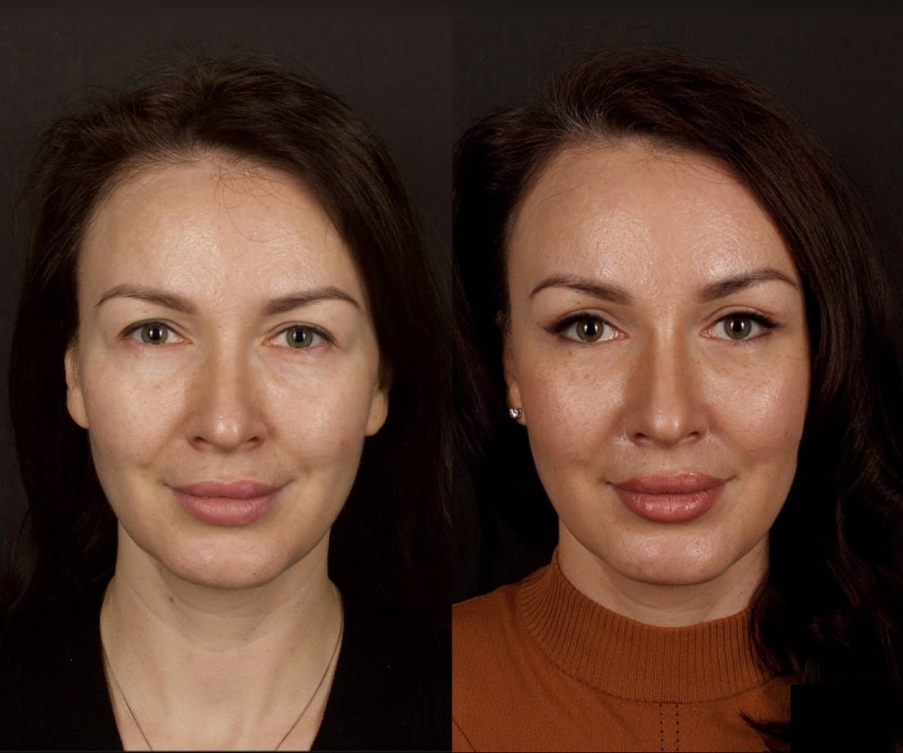
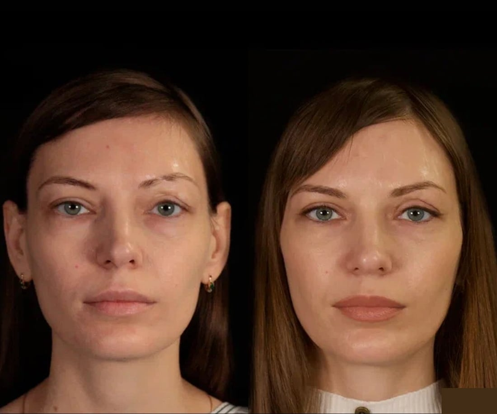
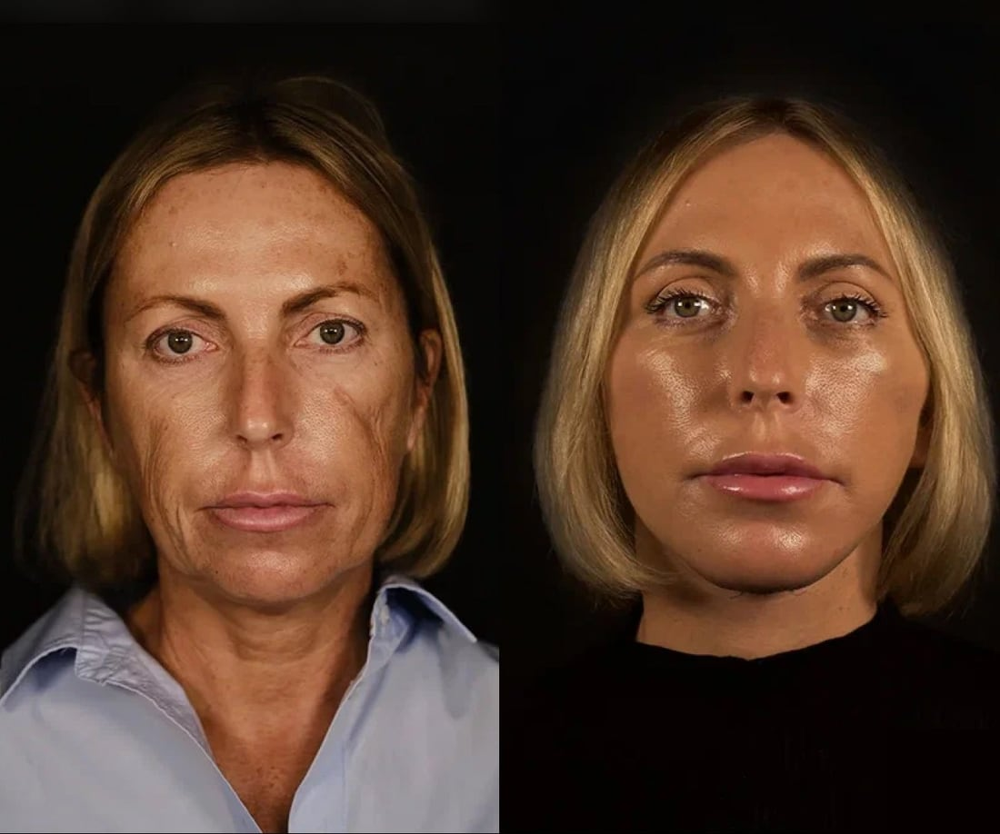
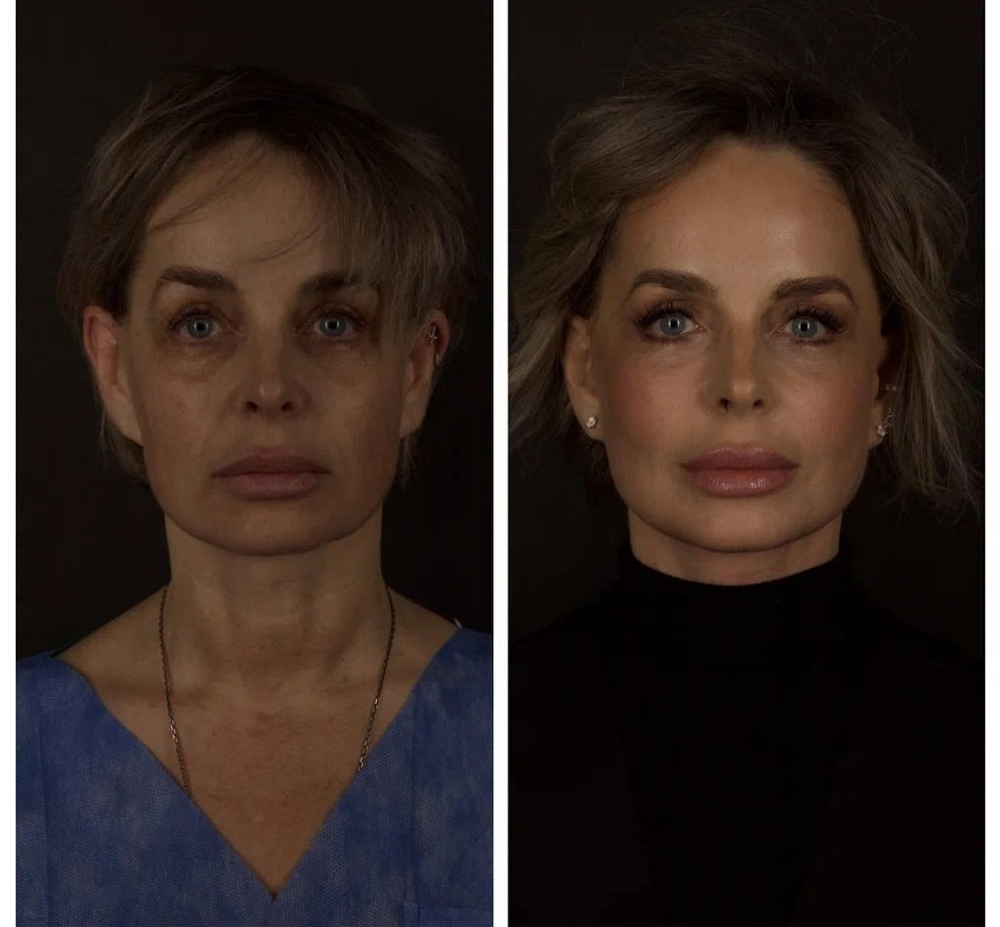

# Искорнев Андрей Александрович

## 1. Кратко о враче

**Искорнев Андрей Александрович**  
Пластический хирург. Эстетическая хирургия лица, шеи и тела.

Искорнев А.А. — основатель и один из учредителей клиники The Platinental Москва, один из учредителей The Platinental Казань. Специализируется на хирургической коррекции возрастных изменений, работе с пропорциями лица, контуром мягких тканей и комплексными вмешательствами в эстетической хирургии. Действительный член ASPS, ISAPS и IPRAS; соавтор зарегистрированного в 2021 году патента РФ №2741620 «Способ подтяжки шеи».

## 2. Ключевые факты

- Пластический хирург с фокусом на эстетической хирургии лица, шеи и тела.
- Основатель и один из учредителей клиники The Platinental Москва, один из учредителей The Platinental Казань.
- Действительный член ASPS / ISAPS / IPRAS.
- Соавтор зарегистрированного в 2021 году патента РФ №2741620 «Способ подтяжки шеи».
- Запись на консультацию можно оформить через The Platinental Казань.
- Операции в Казани возможны по индивидуальному графику.

## 3. Подход врача

**Планирование по анатомии и показаниям**

В работе с лицом Искорнев А.А. оценивает анатомию пациента, пропорции, мимику, возрастные изменения, состояние мягких тканей и медицинские показания к операции.

Задача эстетической хирургии — выбрать обоснованный объем вмешательства: скорректировать возрастные изменения, улучшить контуры и сохранить естественный результат.

Сначала врач проводит диагностику и определяет показания. После этого подбираются метод, объем коррекции и реалистичный прогноз результата.

## 4. Хирургические направления

Искорнев А.А. консультирует и оперирует как пластический хирург. В The Platinental Казань можно оформить запись на консультацию и обсудить возможность операции в Казани по индивидуальному графику.

**Лицо и шея**

- SMAS / Deep plane SMAS lifting.
- Платизмопластика.
- Височный лифтинг.
- Блефаропластика.
- Липофилинг лица и век.
- Работа с возрастными изменениями нижней трети лица и шеи.

**Нос, ткани и рубцы**

- Ринопластика.
- Липомоделирование.
- Пластика рубцов и микрохирургическая техника работы с рубцами.

**Комплексное планирование**

- Гармонизация внешности.
- Оценка пропорций лица, мимики, возраста, состояния тканей и личного запроса пациента.
- Подбор объема вмешательства после консультации и диагностики.

## 5. Образование

- 2007 — Российский государственный медицинский университет им. Н.И. Пирогова, «Лечебное дело».
- 2007-2009 — Российский научный центр хирургии им. академика Б.В. Петровского РАМН, ординатура по специальности «Хирургия».
- 2007 — Государственный научный центр лазерной медицины, специализированные курсы по лазерной медицине.
- 2008 — Российская медицинская академия последипломного образования Росздрава, «Микрохирургия».
- 2008 — Учебный центр «Международной медицинской корпорации», пластическая, реконструктивная, эстетическая и косметологическая хирургия и микрохирургия.
- 2008 — Московская международная высшая школа бизнеса МИРБИС, MBA «Управление медицинским бизнесом».
- 2009 — Учебный центр «Международной медицинской корпорации», диплом и сертификат по специальности «Пластическая хирургия».
- 2014 — РНИМУ им. Н.И. Пирогова, диплом и сертификат по специальности «Пластическая хирургия».
- 2019 — РНИМУ им. Н.И. Пирогова, «Пластическая хирургия».
- 2020 — РНИМУ им. Н.И. Пирогова, «Хирургия».

## 6. Профессиональные членства и обучение

- ASPS — American Society of Plastic Surgeons.
- ISAPS — International Society of Aesthetic Plastic Surgery.
- IPRAS — International Confederation of Plastic, Reconstructive and Aesthetic Surgery.
- Paces Plastic Surgery & Recovery Center, Атланта.
- Clinique Elysee Montaigne, Париж.
- Курсы по лазерной блефаропластике, липофилингу, липомоделированию и микрохирургической технике пластики рубцов.

## 7. Патентная работа

Искорнев А.А. — соавтор зарегистрированного в 2021 году патента РФ №2741620 «Способ подтяжки шеи».

Простыми словами, патент относится к хирургической коррекции возрастных изменений шеи. В нем описан способ работы с мягкими тканями шеи и шейно-подбородочной зоны, чтобы улучшить контур шеи и нижней трети лица.

## 8. Результаты до/после

**Эстетическая хирургия лица: коррекция возрастных изменений**

**Эстетическая хирургия лица: работа с контурами и пропорциями**

**Эстетическая хирургия лица: комплексная коррекция лица**

**Эстетическая хирургия лица: коррекция нижней трети лица и шеи**

## 9. Отзывы

**[SMAS-подтяжка] Консультация и отношение команды**

> «Очень не нравились возрастные изменения — а особенно расплывшийся овал лица. После консультации у Андрея Александровича мне сделали в The Platinental круговую подтяжку SMAS. Коллектив отличный, отношение к пациентам внимательное».

300experts, 02.11.2015 · [Оригинал отзыва](https://300experts.ru/doctors/iskornev-andrey-aleksandrovich/)

**[Липофилинг век] Понятная консультация перед процедурой**

> «После консультации в The Platinental Aesthetic Lounge хирург посоветовал мне сделать липофилинг век. Я очень волновалась, ведь процедуру проводили в области глаз. Процедуру провели под местным наркозом, что для меня было очень важно».

300experts, дата в выдаче не указана · [Оригинал отзыва](https://300experts.ru/doctors/iskornev-andrey-aleksandrovich/)

**[Ринопластика] Отношение к делу**

> «Неплохая клиника Искорнева Андрея. Помогли получить отличный носик. Цены, наверное, как мне показалось, несколько выше, чем в других клиниках, но и отношение к делу здесь соответствующее. В общем, я осталась довольной».

Biokrasota, 27.10.2011 · [Оригинал отзыва](https://www.biokrasota.ru/clinic1142/)

## 10. Вопросы и ответы

**Что означает индивидуальное планирование операции?**  
Это подход, при котором врач оценивает анатомию, возрастные изменения, состояние тканей, показания и запрос пациента. На этой основе выбираются метод и объем вмешательства.

**Что означают ASPS, ISAPS и IPRAS?**  
ASPS, ISAPS и IPRAS — профессиональные сообщества в пластической, реконструктивной и эстетической хирургии. У Искорнева А.А. они указаны как личные профессиональные членства врача.

**С какими запросами можно обратиться к Искорневу А.А.?**  
К Искорневу А.А. обращаются с запросами по эстетической хирургии лица, шеи и тела: возрастные изменения, контуры мягких тканей, пропорции лица и комплексное планирование операции.

**Можно ли записаться к Искорневу А.А. через The Platinental Казань?**  
Да. Запись на консультацию можно оформить через The Platinental Казань. Администратор уточнит формат консультации, ближайшие даты и какие фото или документы подготовить.

**Искорнев А.А. проводит операции в Казани?**  
Да, операции в Казани возможны по индивидуальному графику. На консультации или при записи администратор уточнит доступные даты, формат подготовки и маршрут пациента.

**Можно ли прийти на консультацию, если я не уверена, нужна ли операция?**  
Да. Консультация нужна, чтобы оценить показания, анатомию, состояние тканей и ожидания. После осмотра врач объясняет, есть ли хирургическая задача и какой объем вмешательства может быть оправдан.

**Что подготовить к консультации по операции на лице?**  
Если ранее уже были операции или процедуры, полезно взять выписки, заключения, снимки и фотографии до/после предыдущих вмешательств. Это помогает точнее оценить исходные данные и ограничения.

## Запись на консультацию

**Записаться на консультацию к Искорневу А.А.**

Запись можно оформить через The Platinental Казань. При записи администратор подскажет формат консультации, возможность операции в Казани, ближайшие даты и список материалов, которые стоит подготовить заранее.

Имеются противопоказания. Необходима консультация специалиста.
