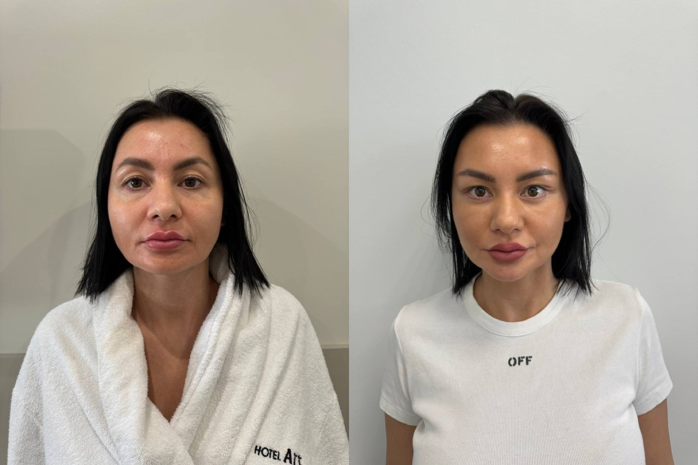
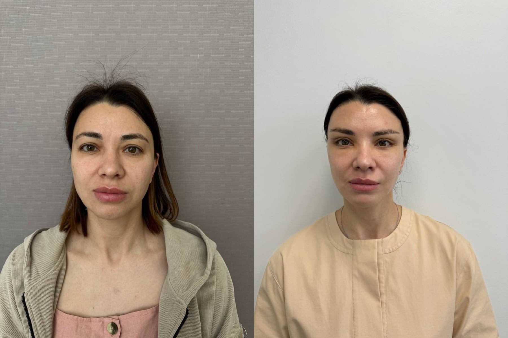
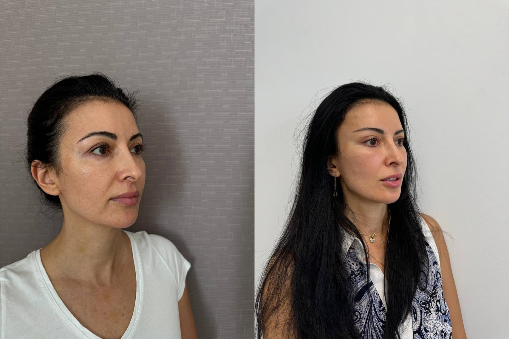

# Тулатова Регина Тимуровна

## 1. Кратко о враче

**Тулатова Регина Тимуровна**  
Пластический хирург. Хирургия лица и периорбитальной зоны.

Специализируется на операциях лица: блефаропластике, височном лифтинге, эндоскопической подтяжке лба, платизмопластике, липофилинге лица и CO2-шлифовке. В работе делает акцент на показаниях к операции, осознанном решении пациента и приоритете безопасности. Проходила обучение у Искорнева А.А. — пластического хирурга, основателя и одного из учредителей клиники The Platinental Москва, одного из учредителей The Platinental Казань.

## 2. Ключевые факты

- Пластический хирург.
- Основной фокус: хирургия лица и сохранение естественных черт.
- Блефаропластика, височный лифтинг, эндоскопическая подтяжка лба, платизмопластика.
- Осознанный подход к операции: сначала показания, обследование и оценка противопоказаний.

## 3. Подход врача

**Сначала показания, потом операция**

Тулатова Р.Т. считает, что пластическая операция должна быть обдуманным решением. Пациенту важно понимать, зачем нужна коррекция, какие есть ограничения и какие риски связаны с вмешательством.

Это особенно важно в хирургии лица. Блефаропластика, височный лифтинг или подтяжка лба могут менять не только отдельную зону, но и характер взгляда. Поэтому врач оценивает не моду на конкретную форму, а анатомию, возрастные изменения, жалобы и ожидания пациента.

Главный принцип: здоровье и показания важнее эстетической спешки.

## 4. С чем обращаются

Профиль Тулатовой Р.Т. — хирургия лица. На консультации врач оценивает не одну зону отдельно, а лицо в целом: веки, положение бровей, шею, контуры, качество тканей и объем.

**Веки и верхняя треть лица**

- Верхняя и нижняя блефаропластика.
- Височный лифтинг.
- Эндоскопическая подтяжка лба.

**Шея и контуры лица**

- Платизмопластика.
- Липосакция шеи.
- Удаление комков Биша.
- Эндопротезирование подбородка.

**Качество тканей и восстановление объема**

- Нанофэтграфтинг.
- Липофилинг лица.
- CO2-шлифовка.
- Удаление биополимеров из губ.

## 5. Образование

- 2014 — Северо-Осетинская государственная медицинская академия, «Лечебное дело».
- 2015 — Первый МГМУ им. И.М. Сеченова, «Хирургия».
- 2017 — РНИМУ им. Н.И. Пирогова, «Пластическая хирургия».

## 6. Профессиональное развитие

**Клинический подход**

Тулатова Р.Т. объясняет, что блефаропластика может быть не только эстетической операцией: нависание верхнего века может мешать повседневной жизни, работе за компьютером и вызывать постоянное напряжение.

Врач подчеркивает, что пациент должен принимать решение об операции осознанно, а перед вмешательством важны обследования, анализы и оценка противопоказаний.

**Профессиональный путь**

Тулатова Р.Т. проходила обучение у Искорнева А.А. — пластического хирурга, основателя и одного из учредителей клиники The Platinental Москва, одного из учредителей The Platinental Казань. В этой работе важны деликатная хирургия лица, внимание к пропорциям и естественный результат без лишнего вмешательства.

## 7. Результаты до/после

**Хирургия лица: фронтальный ракурс**

**Хирургия лица: фронтальный ракурс**

**Хирургия лица: ракурс 3/4**

## 8. Отзывы

**[Блефаропластика и височный лифтинг] Шов через 7 дней**

> «Доктор Тулатова сделала мне операцию по круговой блефаропластике и височному лифтингу. Очень профессионально, легкая и быстрая реабилитация. Все подруги просят контактную информацию Регины Тимуровны. На фото шов через 7 дней».

ПроДокторов, 24.06.2024 · [Оригинал отзыва](https://prodoctorov.ru/kazan/lpu/26588-platinental/otzivi/)

## 9. Вопросы и ответы

**Тулатова Р.Т. занимается только блефаропластикой?**  
Нет. Профиль врача шире: блефаропластика, височный лифтинг, эндоскопическая подтяжка лба, платизмопластика, липофилинг лица, CO2-шлифовка и другие операции лица.

**Можно ли прийти на консультацию, если я хочу «модный» разрез глаз?**  
Да, но врач сначала оценит показания и объяснит, как операция может изменить характер лица. Решение должно быть обдуманным, а не принятым только из-за тренда.

**Блефаропластика бывает только эстетической операцией?**  
Нет. Иногда нависание века мешает в быту, при работе за компьютером или вызывает постоянное напряжение. На консультации врач определит, есть ли показания к операции.

**Можно ли совместить несколько операций лица?**  
Иногда да, но это зависит от анатомии, объема вмешательства и состояния здоровья. Тактику врач определяет после очной консультации.

**Можно ли получить онлайн-консультацию?**  
Да. Онлайн-консультацию можно оформить через администратора; при записи подскажут, какие фото или документы подготовить.

## Запись на консультацию

**Записаться на консультацию к Тулатовой Р.Т.**

На консультации врач разберет Ваш запрос, оценит исходные данные и объяснит, какие варианты коррекции возможны именно в Вашем случае.

Имеются противопоказания. Необходима консультация специалиста.

