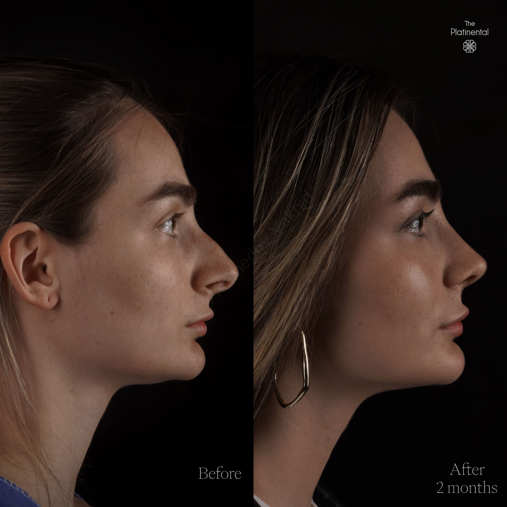
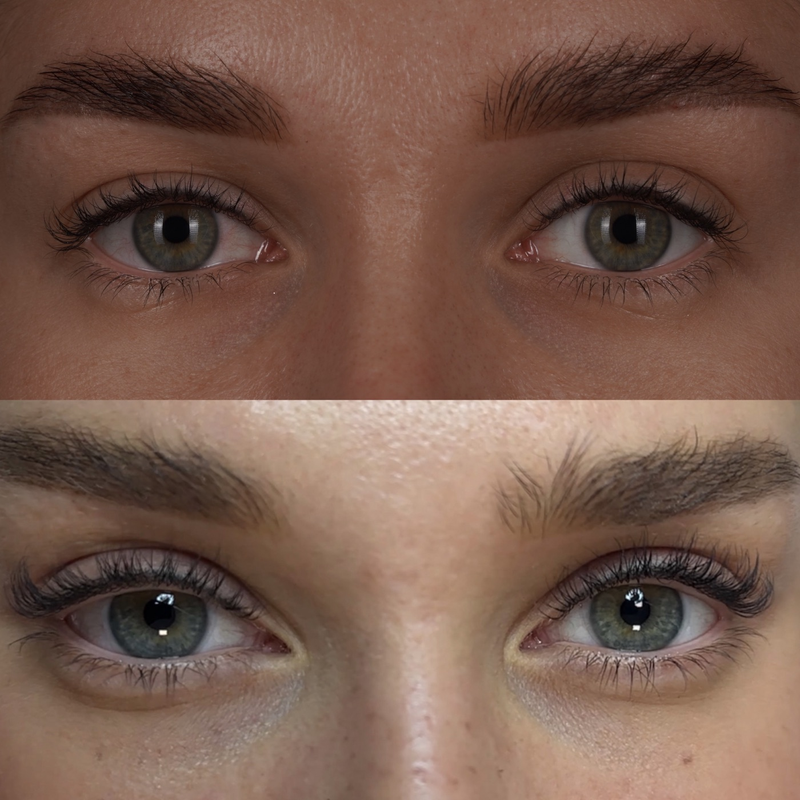

# Мамедов Вахид Аждарович

## 1. Кратко о враче

**Мамедов Вахид Аждарович**  
Пластический хирург. Челюстно-лицевая хирургия, ринопластика, хирургия лица и шеи.

Профиль врача объединяет эстетическую и функциональную хирургию лица: ринопластику, риносептопластику, операции на лицевом скелете, хирургию век и шеи, коррекцию последствий предыдущих вмешательств. Прошел ординатуру по челюстно-лицевой хирургии в МОНИКИ им. М.Ф. Владимирского, обучался сохраняющей и структурной ринопластике. Соавтор зарегистрированного в 2021 году патента РФ №2741620 «Способ подтяжки шеи».

## 2. Ключевые факты

- Челюстно-лицевая хирургия: ординатура в МОНИКИ им. М.Ф. Владимирского.
- Профиль: эстетическая и функциональная хирургия лица и шеи.
- Обучение по сохраняющей и структурной ринопластике.
- Соавтор зарегистрированного в 2021 году патента РФ №2741620 «Способ подтяжки шеи».

## 3. Подход врача

**Когда важны форма, анатомия и лицевой скелет**

Ринопластика, гениопластика и операции на лице требуют точной работы с костями, хрящами, мягкими тканями и дыхательной функцией. Поэтому Мамедов В.А. планирует операцию под конкретную анатомию пациента, пропорции лица и внешний запрос.

На консультации врач разбирает исходные особенности: форму носа, перегородку, дыхание, пропорции лица, толщину кожи, предыдущие операции или травмы. После этого объясняет, какой объём коррекции возможен и где есть ограничения.

Такой подход особенно важен при сложных и повторных случаях, когда нужно учитывать не только внешний результат, но и последствия предыдущих вмешательств.

## 4. С чем обращаются

У Мамедова В.А. широкий профиль операций лица и шеи. Основные направления консультации — ринопластика, риносептопластика, повторные случаи и хирургия лицевого скелета; также можно обратиться с другими задачами в области лица.

**Эстетическая и функциональная хирургия лица и шеи**

- Ринопластика.
- Риносептопластика.
- Повторные случаи после предыдущих вмешательств.
- Блефаропластика, в том числе ориентальная блефаропластика.
- Контурная пластика лицевого скелета с использованием имплантатов.
- Гениопластика, фронтопластика, мандибулопластика, маляропластика.
- Эндоскопическое омоложение верхней и средней трети лица.
- Платизмопластика.
- Отопластика.
- Хейлопластика.
- Липофилинг лица.

Комки Биша и липосакцию шеи не выносим как публичные направления Мамедова В.А. после правок 18.05.2026.

**Реконструктивная хирургия**

- Коррекция рубцов в области лица и шеи.
- Устранение послеоперационных, посттравматических и послеожоговых деформаций тканей лица и шеи.
- Коррекция отрицательных результатов предыдущих хирургических вмешательств.

## 5. Образование

- 2010-2015 — Дальневосточный государственный медицинский университет, специальность «Стоматология».
- 2017-2019 — Московский областной научно-исследовательский клинический институт им. М.Ф. Владимирского, ординатура по специальности «Челюстно-лицевая хирургия».
- 2019 — МОНИКИ им. М.Ф. Владимирского, диплом и сертификат по специальности «Челюстно-лицевая хирургия».

## 6. Дополнительное образование

- 2018 — AMWC Aesthetic & Anti-aging medicine world congress, Монако, Монте-Карло.
- 2018 — научная конференция «Детская челюстно-лицевая хирургия и стоматология», Москва.
- 2020 — курс по сохраняющей ринопластике, Москва.
- 2020 — Teorhinoplasty Course под руководством Dr. Teoman Dogan, Турция.
- 2021 — повышение квалификации «Аспекты эндоскопической хирургии патологии ЛОР-органов».
- 2021 — курс «Контурная пластика лица. Грациализация, феминизация, маскулинизация. Редукционные и аугментационные методики», Санкт-Петербург.
- 2021 — профессиональная переподготовка «Преподавание анатомии и физиологии в образовательной организации».
- 2021 — повышение квалификации «Орто-фациальная хирургия и ортодонтия».
- 2021 — кадавер-курс «Теоринопластика», Санкт-Петербург, под руководством Dr. Teoman Dogan.
- 2021 — «Сохраняющая и структурная ринопластика», Санкт-Петербург, Abdulkadir Goksel.

## 7. Патентная работа

Мамедов В.А. — соавтор зарегистрированного в 2021 году патента РФ №2741620 «Способ подтяжки шеи».

Простыми словами, патент относится к хирургической коррекции возрастных изменений шеи. В нем описан способ работы с мягкими тканями шеи и шейно-подбородочной зоны, чтобы улучшить контур шеи и нижней трети лица.

## 8. Результаты до/после

**Ринопластика: профильный ракурс**

**Хирургия верхней трети лица / зона век**

## 9. Отзывы

**[Риносептопластика и эндоскопическая подтяжка] Сочетанная операция лица**

> «Сегодня наступил 38 день после сохраняющей риносептопластики и эндоскопической подтяжки лба и висков у доктора Мамедова Вахида Аждаровича в клинике The Platinental. Я рада, что решилась на операцию. Я рада, что все прошло гораздо легче, приятнее, чем я ожидала. Я рада, что сделала правильный выбор доктора и клиники».

Светлана.  
«Красота и медицина», 25.10.2022 · [Оригинал отзыва](https://www.krasotaimedicina.ru/doc/mamedov-vahid-azhdarovich-199290580/)

**[Консультация] Ответы на вопросы**

> «Хочу высказать свою искреннюю признательность врачу Вахиду! Доктор знает ответы абсолютно на все вопросы. Огромная благодарность за все, что Вы делаете для ваших больных. С почтением, Людмила».

Людмила.  
«Красота и медицина», 15.04.2021 · [Оригинал отзыва](https://www.krasotaimedicina.ru/doc/mamedov-vahid-azhdarovich-199290580/)

**[Консультация] Осмотр и рекомендации**

> «Своеобразный доктор. Он выслушал меня, осмотрел и дал советы. Я получила консультацию, которая удовлетворила меня».

«Красота и медицина», 08.04.2021 · [Оригинал отзыва](https://www.krasotaimedicina.ru/doc/mamedov-vahid-azhdarovich-199290580/)

## 10. Вопросы и ответы

**Можно ли прийти к Мамедову В.А. на консультацию по повторной ринопластике?**  
Да, врач консультирует по сложным и повторным случаям. Точную тактику можно определить только после осмотра, анализа предыдущего вмешательства и оценки анатомии.

**Врач занимается только ринопластикой?**  
Нет. Профиль врача шире: эстетическая и функциональная хирургия лица и шеи, операции на лицевом скелете, веках, подбородке, шее, а также коррекция последствий травм и предыдущих вмешательств.

**Что взять на консультацию?**  
Если операция уже была, возьмите выписки, снимки, заключения и фотографии до/после предыдущего вмешательства, если они есть. Это поможет врачу точнее оценить ситуацию.

**Можно ли обсудить дыхание во время консультации по ринопластике?**  
Да. При риносептопластике врач оценивает не только форму носа, но и функциональную часть. При необходимости может потребоваться дополнительная диагностика.

**Можно ли получить онлайн-консультацию?**  
Да. Онлайн-консультацию можно оформить через администратора; при записи подскажут, какие фото или медицинские документы подготовить.

## Запись на консультацию

**Записаться на консультацию к Мамедову В.А.**

На консультации врач разберет Ваш запрос, оценит исходные данные и объяснит, какие варианты коррекции возможны именно в Вашем случае.

Имеются противопоказания. Необходима консультация специалиста.
