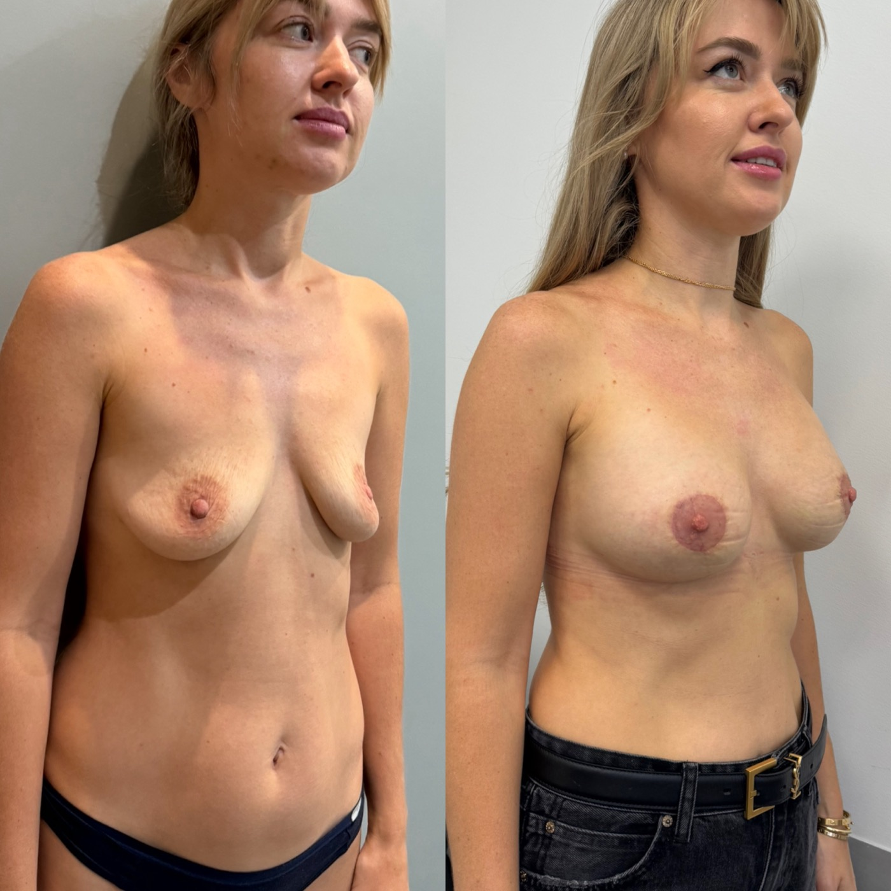
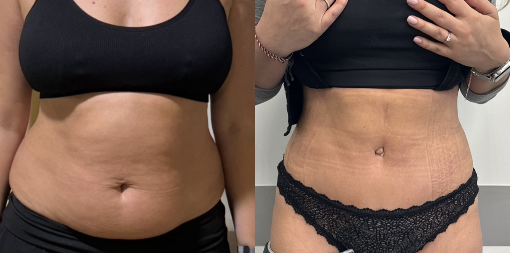
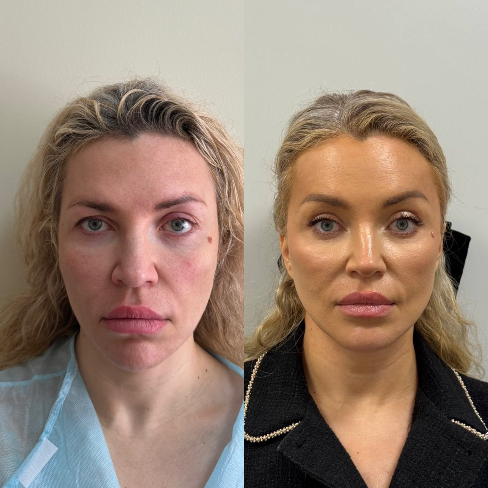
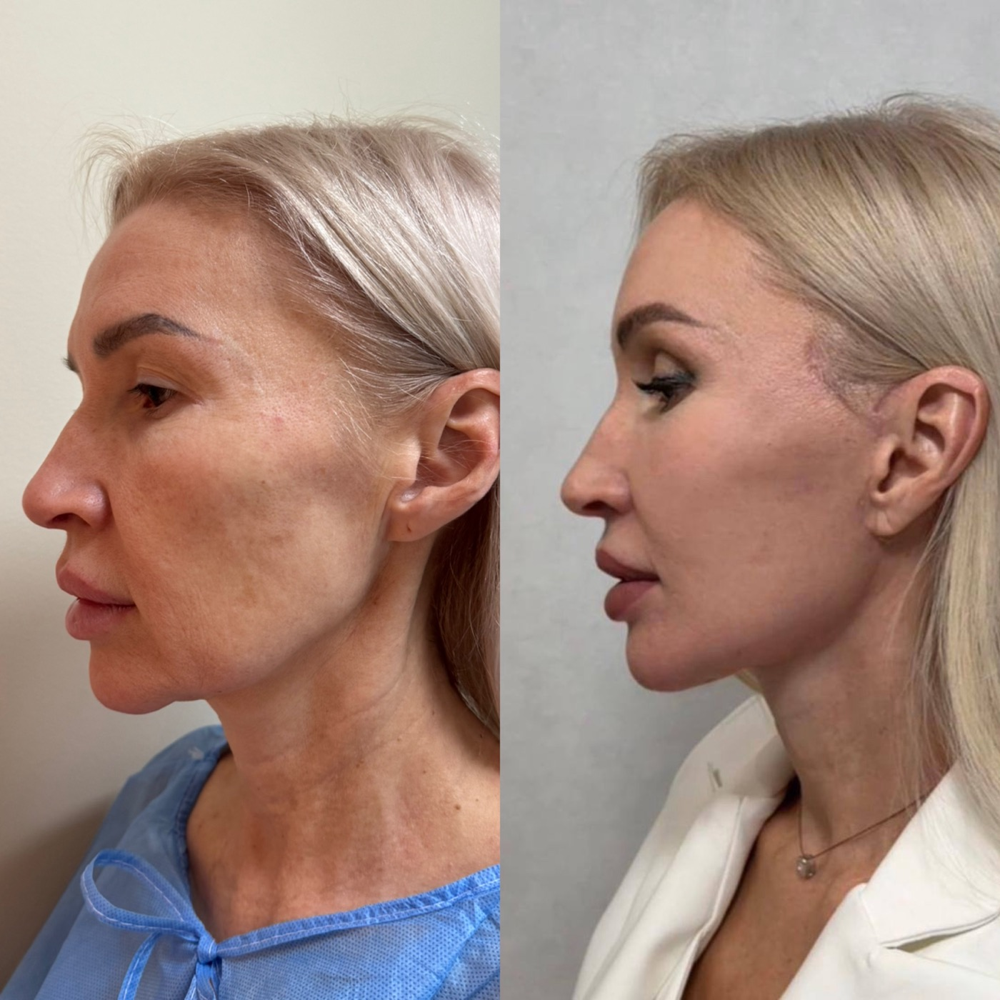
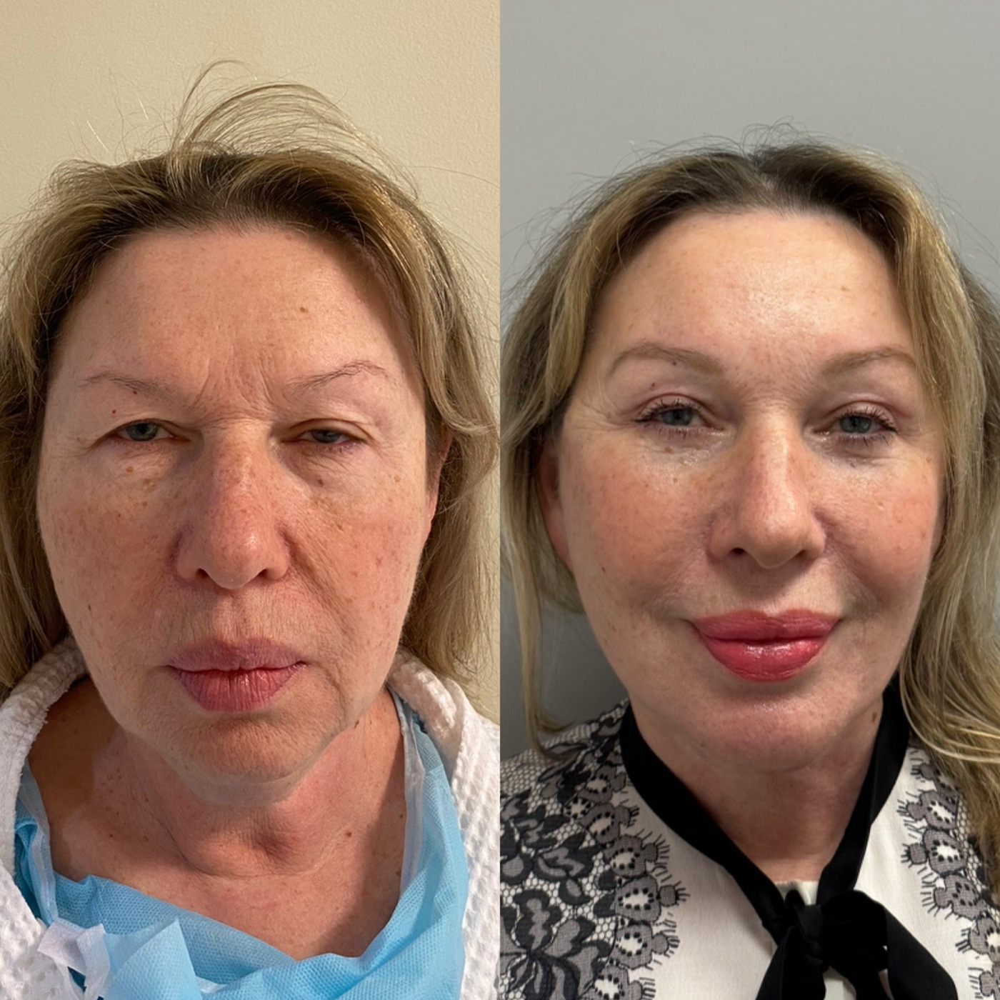

# Васильев Максим Николаевич

## 1. Кратко о враче

**Васильев Максим Николаевич**  
Пластический хирург, общий хирург, к.м.н.

Работает с операциями на лице, груди и теле: блефаропластикой, миниинвазивным лифтингом бровей, маммопластикой, липосакцией, липомоделированием, миниабдоминопластикой и коррекцией рубцов. Научный бэкграунд связан с общей хирургией: Васильев М.Н. защитил диссертацию по хирургии послеоперационных срединных вентральных грыж. Соавтор зарегистрированного в 2021 году патента РФ №2741620 «Способ подтяжки шеи».

## 2. Ключевые факты

- Пластический хирург и общий хирург.
- Кандидат медицинских наук.
- Защитил диссертацию по хирургии послеоперационных срединных вентральных грыж.
- Профиль: пластика лица, груди и тела.
- Соавтор зарегистрированного в 2021 году патента РФ №2741620 «Способ подтяжки шеи».

## 3. Подход врача

**Разобрать зону, а не назначить операцию по названию**

На консультации Васильев М.Н. сначала уточняет, какая зона беспокоит пациента и за счет чего сформировалась проблема. Например, в области глаз причина может быть не только в избытке кожи верхнего века, но и в положении брови, лба, объеме тканей под глазами или качестве кожи.

От этого зависит маршрут: блефаропластика, лифтинг бровей, эндоскопическая подтяжка лба, косметологическая коррекция или наблюдение без операции. В отзывах пациенты отдельно отмечают, что врач может не рекомендовать хирургическое вмешательство, если для запроса достаточно косметологического метода.

В операциях на груди и теле Васильев М.Н. также оценивает ткани, рубцы, объем коррекции и восстановление. База общей хирургии и диссертационная работа по герниопластике важны именно в таких задачах: нужно учитывать не только форму, но и состояние тканей после операций, родов, изменения веса или предыдущих вмешательств.

## 4. С чем обращаются

К Васильеву М.Н. можно обратиться с запросами по лицу, груди и телу.

**Лицо и веки**

- Блефаропластика.
- Миниинвазивный лифтинг бровей.
- Коррекция возрастных изменений лица.
- Пластика рубцов.

**Грудь**

- Маммопластика.
- Редукция груди.
- Подтяжка груди.

**Тело**

- Липосакция.
- Липомоделирование.
- Миниабдоминопластика.

## 5. Образование и научная работа

- 2006 — Ульяновский государственный университет, специальность «Лечебное дело».
- 2006-2008 — Ульяновский государственный университет, Институт медицины, экологии и физической культуры, специальность «Хирургия».
- 2011 — защита диссертации на тему «Выбор метода герниопластики у больных с послеоперационными срединными вентральными грыжами».
- 2013 — Первый МГМУ им. И.М. Сеченова, специальность «Пластическая хирургия».
- 2013 — Национальный медико-хирургический центр им. Н.И. Пирогова, повышение квалификации по специальности «Хирургия».
- 2018 — РНИМУ им. Н.И. Пирогова, сертификат по специальности «Пластическая хирургия».

Васильев М.Н. участвует в российских и международных конференциях.

## 6. Патентная работа

Васильев М.Н. — соавтор зарегистрированного в 2021 году патента РФ №2741620 «Способ подтяжки шеи».

Простыми словами, патент относится к хирургической коррекции возрастных изменений шеи. В нем описан способ работы с мягкими тканями шеи и шейно-подбородочной зоны, чтобы улучшить контур шеи и нижней трети лица.

## 7. Результаты до/после

**Хирургия молочных желез**

**Контурирование тела / область живота**

**Хирургия лица: фронтальный ракурс**

**Хирургия лица: профильный ракурс**

**Хирургия лица: коррекция возрастных изменений**

## 8. Отзывы

**[Консультация по блефаропластике] Врач не навязывает операцию**

> «Меня волновали заломы и смещение пакетов в зоне вокруг глаз, я обратилась к Васильеву М.Н. за консультацией по блефаропластике. Врач дал честный совет: обратиться к хорошему косметологу, и для этого достаточно контурной пластики, не стоит беспокоить эту зону, пока нет показаний».

ПроДокторов, 22.01.2024 · [Оригинал отзыва](https://prodoctorov.ru/kazan/vrach/603806-vasilev/)

**[Блефаропластика / лифтинг бровей] Минимальный объем вмешательства**

> «Хотела сделать блефаропластику, но когда пришло время операции, поняла, что не готова прощаться со своими пышными веками. Васильев Максим Николаевич предложил минимальные изменения с бровями».

Яндекс, 15.12.2024 · [Оригинал отзыва](https://ya.ru/medicine/doctor/vasilev_maksim_YJDHJnndWl7l8)

**[Эндоскопическая подтяжка лба] Выбор метода после консультации**

> «В апреле 2022 года мне была выполнена эндоскопическая подтяжка лба. Давно искала варианты решения своей проблемы, рассматривала разные типы операций, в т. ч. блефаропластику. В результате подтяжка лба решила проблемы с нависающим веком и угрюмым взглядом».

«Красота и медицина», 24.06.2022 · [Оригинал отзыва](https://www.krasotaimedicina.ru/doc/vasilv-maksim-nikolavi-21298904/)

## 9. Вопросы и ответы

**Можно ли прийти к Васильеву М.Н. на консультацию, если я не уверена, нужна ли операция?**  
Да. Консультация нужна как раз для оценки показаний. Врач объяснит, есть ли хирургическая задача, какой объем коррекции возможен и когда лучше выбрать другой метод.

**Васильев М.Н. занимается только операциями на лице?**  
Нет. Профиль врача шире: блефаропластика и операции на лице, маммопластика, липосакция, липомоделирование, миниабдоминопластика, коррекция рубцов.

**Зачем пластическому хирургу база общей хирургии?**  
У Васильева М.Н. есть подготовка и опыт в общей хирургии, а также защищенная диссертация по хирургической теме. Для пластической хирургии это важно там, где нужно учитывать не только эстетику, но и ткани, рубцы, восстановление и общие хирургические риски.

**Можно ли обсудить несколько зон за одну консультацию?**  
Да. Если запрос касается лица, груди и тела одновременно, врач может оценить приоритеты и объяснить, какие задачи можно решать вместе, а какие лучше разделить по этапам.

**Можно ли получить онлайн-консультацию?**  
Да. Онлайн-консультацию можно оформить через администратора; при записи подскажут, какие фото или документы подготовить.

## Запись на консультацию

**Записаться на консультацию к Васильеву М.Н.**

На консультации врач разберет Ваш запрос, оценит исходные данные, объяснит показания и ограничения и поможет выбрать реалистичный маршрут коррекции.

Имеются противопоказания. Необходима консультация специалиста.
