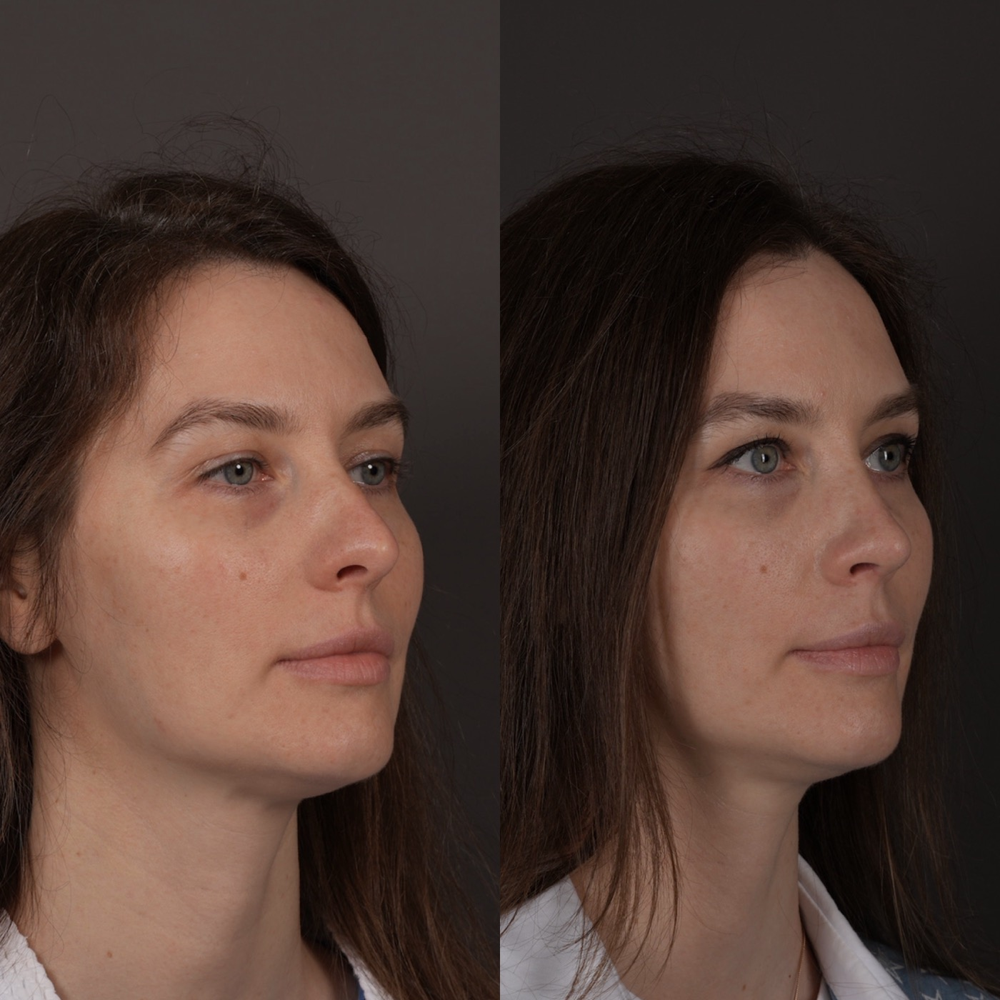
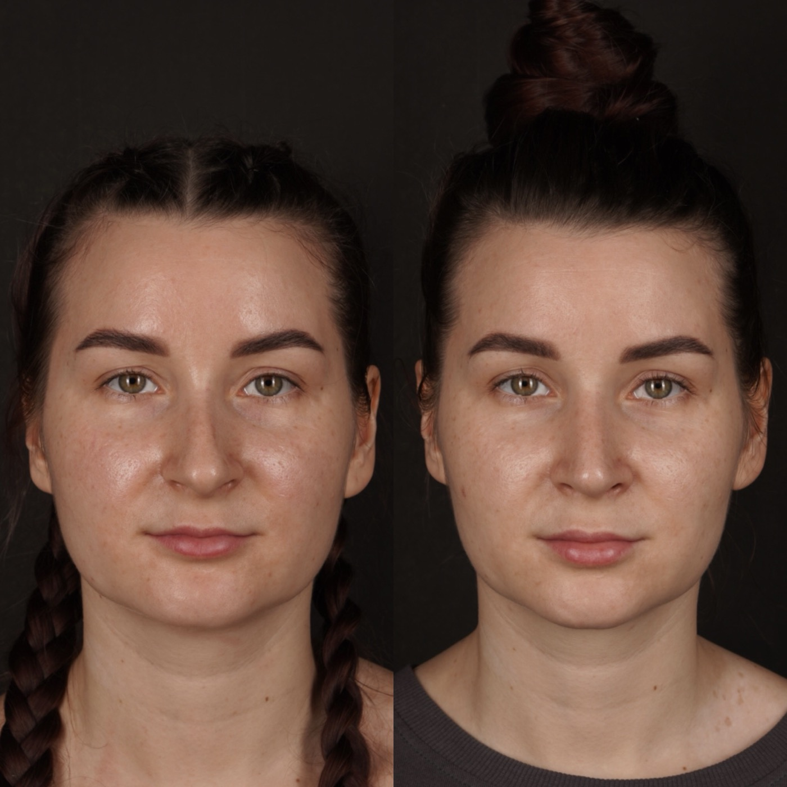
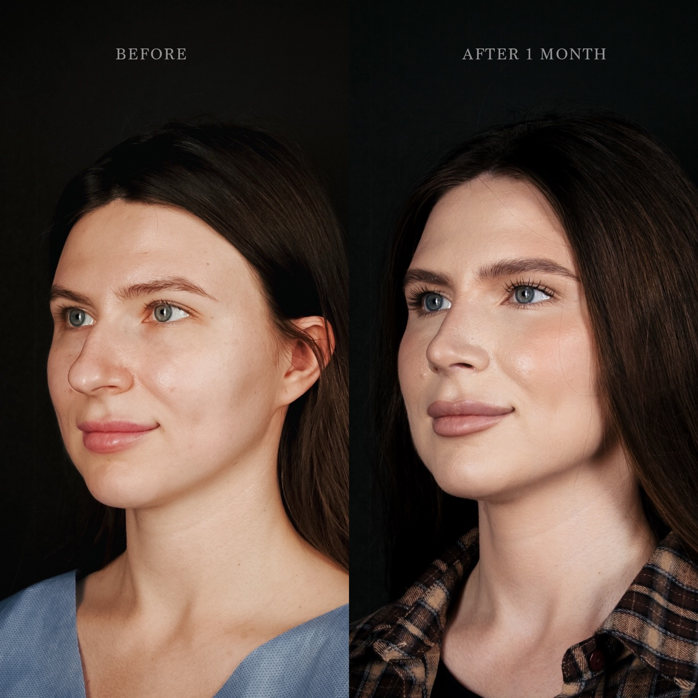

# Марданова Дженнет Мевлютовна

## 1. Кратко о враче

**Марданова Дженнет Мевлютовна**  
Пластический хирург. Риносептопластика.

Основной профиль — эстетическая и функциональная хирургия носа: ринопластика, риносептопластика, коррекция формы носа и работа с жалобами на носовое дыхание. Образование и ординатура по пластической хирургии — Первый МГМУ им. И.М. Сеченова; в профессиональном пути есть участие в профильных конгрессах по пластической хирургии. Марданова Д.М. обучалась у Мамедова В.А. — пластического хирурга The Platinental Казань, специалиста по ринопластике и хирургии лица.

## 2. Ключевые факты

- Пластический хирург.
- Основной профиль: риносептопластика, эстетическая и функциональная хирургия носа.
- Дополнительное направление: верхняя и нижняя блефаропластика.
- Образование и ординатура по пластической хирургии в Первом МГМУ им. И.М. Сеченова.
- Участница профильных конгрессов по пластической хирургии в 2021-2023 годах.
- В отзывах пациенты отмечают ринопластику у Мардановой Д.М. и связь с врачом после операции.

## 3. Подход врача

**Риносептопластика с учетом анатомии и дыхания**

В риносептопластике важен не возраст врача сам по себе, а школа, клиническая подготовка, понимание анатомии и работа в команде с сильным наставником. Современная ринохирургия опирается на планирование, сохранение опорных структур носа, учет дыхания и аккуратную работу с тканями.

Марданова Д.М. ведет риносептопластику в этой логике: оценивает форму носа, перегородку, дыхание, пропорции лица, исходные ограничения и этапы восстановления. Для пациента это важнее формального стажа в годах: качество результата зависит от подготовки, техники, разбора конкретной анатомии и послеоперационного наблюдения.

Дополнительное направление врача — блефаропластика. Основной акцент консультации остается на риносептопластике.

## 4. Риносептопластика

Риносептопластика решает эстетические и функциональные задачи носа. На консультации Марданова Д.М. оценивает форму, пропорции лица, дыхание, состояние перегородки и ожидания пациента.

С чем можно обратиться:

- изменить форму спинки или кончика носа;
- сделать профиль мягче и гармоничнее;
- обсудить последствия травмы или врожденные особенности формы;
- совместить эстетическую задачу с функциональными жалобами;
- понять, показана ли операция сейчас или лучше выбрать другой маршрут.

Перед операцией важно обсудить не только желаемую форму, но и восстановление, ограничения, этапы осмотров и индивидуальные риски.

## 5. Блефаропластика

Блефаропластика помогает скорректировать избыток кожи и тканей в области верхних или нижних век. Задача Мардановой Д.М. — не «изменить лицо», а аккуратно работать с зоной век, чтобы взгляд выглядел более открытым и при этом сохранял естественное выражение.

С чем можно обратиться:

- нависание верхних век;
- ощущение тяжелого взгляда;
- возрастные изменения нижних век;
- асимметрия или индивидуальные особенности зоны век;
- желание понять, нужна ли операция или достаточно косметологического подхода.

Окончательный план врач определяет после очного осмотра: в зоне век особенно важно учитывать кожу, положение бровей, мимику и общее состояние тканей.

## 6. Образование и профессиональное развитие

- 2016-2022 — Первый Московский государственный медицинский университет имени И.М. Сеченова, специальность «Лечебное дело».
- 2022-2024 — Первый Московский государственный медицинский университет имени И.М. Сеченова, ординатура по специальности «Пластическая хирургия».
- 2021 — X Национальный конгресс «Пластическая хирургия, эстетическая медицина и косметология», Москва.
- 2022 — конференция молодых ученых памяти академика Н.О. Миланова, Москва.
- 2022 — Национальный хирургический конгресс, XIV съезд хирургов России, Москва.
- 2022 — XI Национальный конгресс имени Н.О. Миланова «Пластическая хирургия, эстетическая медицина и косметология», Москва.
- 2023 — летний конгресс «Пластическая, реконструктивная хирургия и косметология», Санкт-Петербург.
- 2023 — Национальный хирургический конгресс, XV съезд хирургов России, Москва.
- 2023 — XII Национальный конгресс имени Н.О. Миланова «Пластическая хирургия, эстетическая медицина и косметология», Москва.

## 7. Обучение и специализация

Марданова Д.М. проходила обучение у Мамедова В.А. — пластического хирурга The Platinental Казань, специалиста по ринопластике и хирургии лица. В риносептопластике врач уделяет внимание анатомии носа, функции дыхания и естественной эстетике результата.

## 8. Результаты до/после

**Риносептопластика / хирургия носа: профильный ракурс**

**Блефаропластика / хирургия верхней трети лица: фронтальный ракурс**

**Риносептопластика / хирургия носа: ракурс 3/4**

## 9. Отзывы

**[Ринопластика] Пациент долго выбирал хирурга**

> «Хочу оставить отзыв о клинике The Platinental. Долго решалась на ринопластику, искала хирурга и нашла Дженнет Мевлютовну. Операция прошла успешно, отдельно хочу поблагодарить персонал за их отношение».

Яндекс.Карты, 14.03.2026 · [Оригинал отзыва](https://yandex.ru/maps/org/the_platinental/1010616435/reviews/)

**[Ринопластика] Врач остается на связи после операции**

> «Делала операцию на нос у Дженнет Мардановой. Всегда на связи уже 8 месяцев. Отвечает на любой вопрос. Чувствую себя в безопасности. Благодарю за такой уровень».

Яндекс.Карты, 28.01.2026 · [Оригинал отзыва](https://yandex.ru/maps/org/the_platinental/1010616435/reviews/)

## 10. Вопросы и ответы

**Можно ли прийти к Мардановой Д.М., если я пока не уверена, нужна ли операция?**  
Да. Консультация нужна, чтобы оценить показания, исходные данные и ожидания. Марданова Д.М. объяснит, есть ли хирургическая задача и какой вариант коррекции уместен.

**Марданова Д.М. занимается только ринопластикой?**  
Основной профиль врача — риносептопластика и блефаропластика. Другие направления можно уточнить у администратора при записи.

**Чем риносептопластика отличается от ринопластики?**  
Ринопластика чаще описывает изменение формы носа. Риносептопластика включает работу с эстетикой и перегородкой носа, когда вместе с формой нужно учитывать функцию дыхания. Окончательный объем операции врач определяет после консультации и обследований.

**Можно ли заранее понять, каким будет результат?**  
На консультации можно обсудить желаемую форму, ограничения и реалистичный вектор коррекции. Точный результат зависит от анатомии, состояния тканей и восстановления, поэтому врач не обещает одинаковый исход для всех пациентов.

**Когда лучше выбирать блефаропластику, а когда косметологию?**  
Это решается после осмотра. Если проблема связана с избытком кожи или тканей, может быть показана операция. Если изменения мягкие, врач может предложить начать с косметологического маршрута или отложить операцию.

**Можно ли получить онлайн-консультацию?**  
Да. Онлайн-консультацию можно оформить через администратора; при записи подскажут, какие фото или документы подготовить.

## Запись на консультацию

**Записаться на консультацию к Мардановой Д.М.**

На консультации врач разберет Ваш запрос, оценит исходные данные и объяснит, какие варианты коррекции возможны именно в Вашем случае.

Имеются противопоказания. Необходима консультация специалиста.

