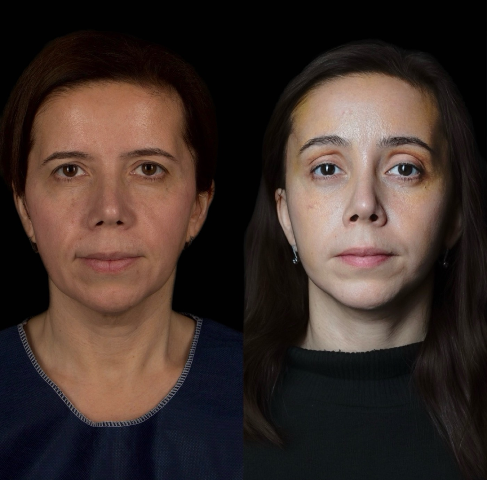
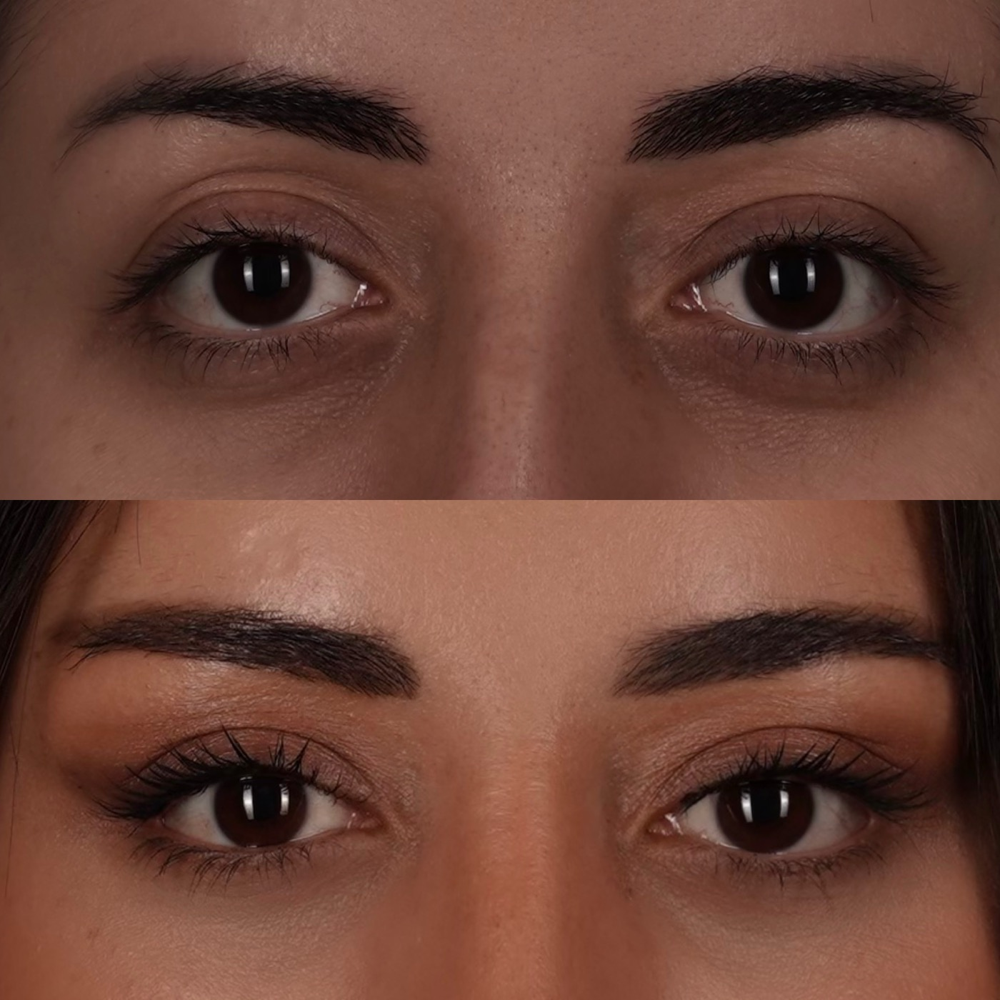
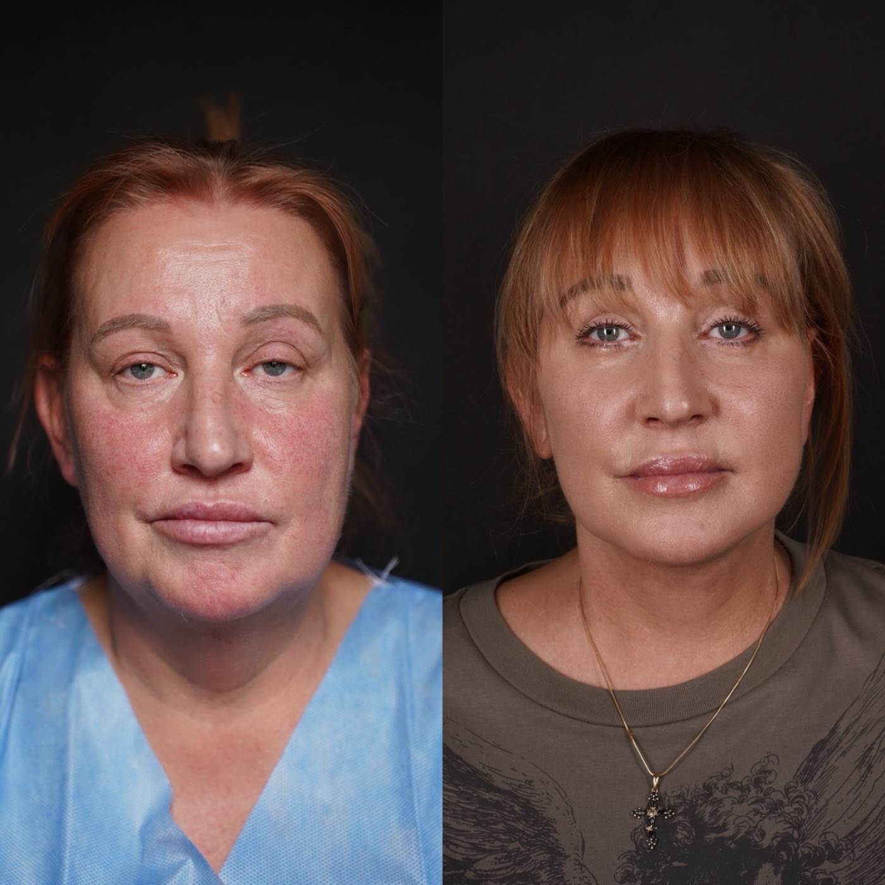
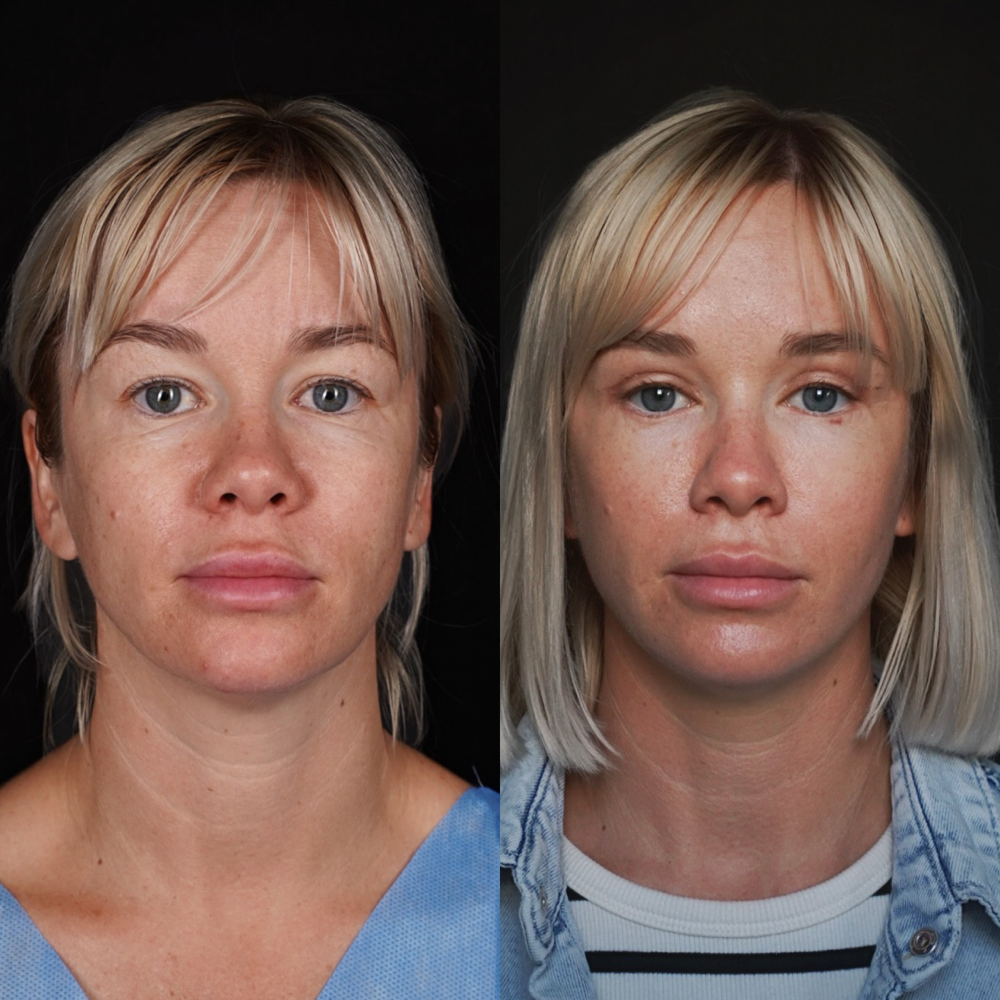
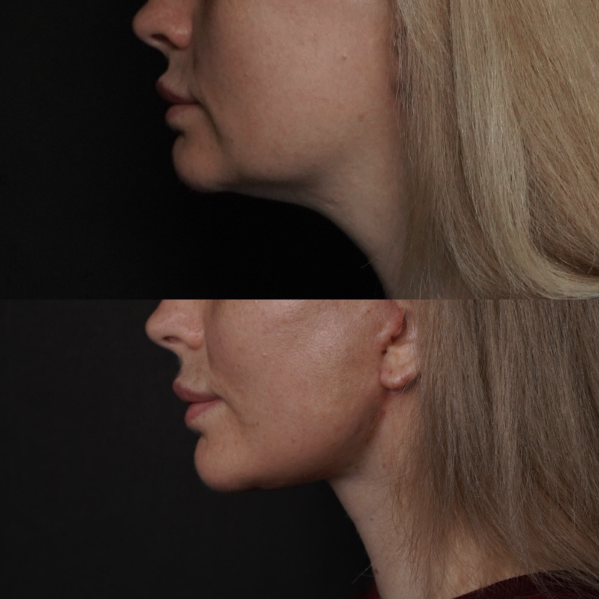

# Бречко Мария Александровна

## 1. Кратко о враче

**Бречко Мария Александровна**  
Пластический хирург. Блефаропластика, хирургия лица, CO2-лазерные протоколы.

Специализируется на верхней и нижней блефаропластике, хирургии лица, CO2-лазерной коррекции кожи, работе с рубцами и периорбитальной зоной. Прошла хирургическую интернатуру после Донецкого национального медицинского университета и ординатуру по пластической хирургии в РНЦХ им. академика Б.В. Петровского. Обучалась у Искорнева А.А. — пластического хирурга, основателя и одного из учредителей клиники The Platinental Москва, одного из учредителей The Platinental Казань.

## 2. Ключевые факты

- Пластический хирург.
- Профиль: верхняя и нижняя блефаропластика, хирургия лица, CO2-лазерные протоколы.
- Ординатура по пластической хирургии в РНЦХ им. академика Б.В. Петровского.
- Хирургическая интернатура после Донецкого национального медицинского университета.
- Участница профильных конгрессов по пластической хирургии в 2022-2023 годах.

## 3. Подход врача

**Смотреть не только на веки**

Запрос на блефаропластику часто звучит просто: «убрать нависание» или «освежить взгляд». Но зона век связана с положением бровей, верхней третью лица, качеством кожи и общим выражением лица.

Бречко М.А. оценивает, что именно формирует проблему: избыток кожи, положение брови, грыжи, рубцы, особенности нижних век или качество кожи. После этого врач объясняет, какой метод подходит: хирургическая блефаропластика, CO2-лазерный протокол, сочетанный подход или наблюдение без операции.

Цель такой консультации — не выбрать самую заметную коррекцию, а подобрать достаточный объем вмешательства под конкретную анатомию.

## 4. Блефаропластика

Блефаропластика помогает скорректировать избыток кожи и тканей в области верхних или нижних век. Важно сохранить естественное выражение лица и не создать ощущение «перетянутого» взгляда.

С чем можно обратиться:

- нависание верхних век;
- тяжесть взгляда;
- возрастные изменения нижних век;
- асимметрия зоны век;
- желание понять, нужна ли операция или можно начать с лазерного/косметологического маршрута.

Окончательный план врач определяет после осмотра. В зоне век особенно важно учитывать положение бровей, мимику, состояние кожи и ожидания пациента.

## 5. CO2-лазерные протоколы

CO2-лазер может использоваться для работы с качеством кожи и рубцами, а также в зоне век, если для этого есть показания. Это не универсальная замена операции: лазер и хирургия решают разные задачи.

CO2-лазер может быть уместен при таких задачах:

- тонкая работа с качеством кожи в зоне век;
- коррекция рубцов;
- лазерная шлифовка по показаниям;
- поддержка результата после хирургического этапа, если врач считает это обоснованным.

Перед процедурой врач должен оценить кожу, фототип, склонность к пигментации, сроки восстановления и противопоказания.

## 6. Лифтинг лица и шеи

Бречко М.А. оценивает возрастные изменения лица не изолированно, а по зонам: веки, брови, средняя треть, овал лица и шея. Это помогает определить, где достаточно локальной коррекции, а где нужен более широкий хирургический план.

## 7. Образование и профессиональное развитие

- Донецкий национальный медицинский университет, специальность «Лечебное дело».
- 2020-2021 — Донецкий национальный медицинский университет, интернатура по специальности «Хирургия».
- 2022-2024 — ФГБНУ «Российский научный центр хирургии им. академика Б.В. Петровского», ординатура по специальности «Пластическая хирургия».
- 2022 — Национальный хирургический конгресс, XIV съезд хирургов России, Москва.
- 2022 — XI Национальный конгресс имени Н.О. Миланова «Пластическая хирургия, эстетическая медицина и косметология», Москва.
- 2023 — летний конгресс «Пластическая, реконструктивная хирургия и косметология», Санкт-Петербург.
- 2023 — Национальный хирургический конгресс, XV съезд хирургов России, Москва.
- 2023 — XII Национальный конгресс имени Н.О. Миланова «Пластическая хирургия, эстетическая медицина и косметология», Москва.

## 8. Обучение и специализация

Бречко М.А. обучалась у Искорнева А.А. — пластического хирурга, основателя и одного из учредителей клиники The Platinental Москва, одного из учредителей The Platinental Казань. В работе с лицом врач уделяет внимание естественности выражения, анатомии верхней трети лица и аккуратному выбору объема коррекции.

## 9. Результаты до/после

**Хирургия лица: фронтальный ракурс**

**Блефаропластика / зона век: фронтальный ракурс**

**Хирургия лица: коррекция возрастных изменений**

**Хирургия лица: фронтальный ракурс**

**Линия шеи / нижняя треть лица**

## 10. Вопросы и ответы

**Можно ли прийти к Бречко М.А., если я не понимаю, нужна операция или лазер?**  
Да. Консультация нужна как раз для выбора метода. Бречко М.А. оценит зону век, кожу, положение бровей и объяснит, какой маршрут уместен.

**CO2-лазер заменяет блефаропластику?**  
Не всегда. CO2-лазер работает с качеством кожи и некоторыми поверхностными изменениями. Если есть выраженный избыток кожи или тканей, может потребоваться хирургическая коррекция.

**Бречко М.А. занимается только блефаропластикой?**  
Нет. Помимо блефаропластики, врач работает с другими направлениями хирургии лица и CO2-лазерными протоколами по показаниям.

**Почему при блефаропластике важно смотреть на положение бровей?**  
Иногда ощущение тяжелого века связано не только с кожей века, но и с положением брови или верхней трети лица. Поэтому врач оценивает зону комплексно.

**Можно ли получить онлайн-консультацию?**  
Да. Онлайн-консультацию можно оформить через администратора; при записи подскажут, какие фото или документы подготовить.

## Запись на консультацию

**Записаться на консультацию к Бречко М.А.**

На консультации врач разберет Ваш запрос, оценит исходные данные и объяснит, какие варианты коррекции возможны именно в Вашем случае.

Имеются противопоказания. Необходима консультация специалиста.

