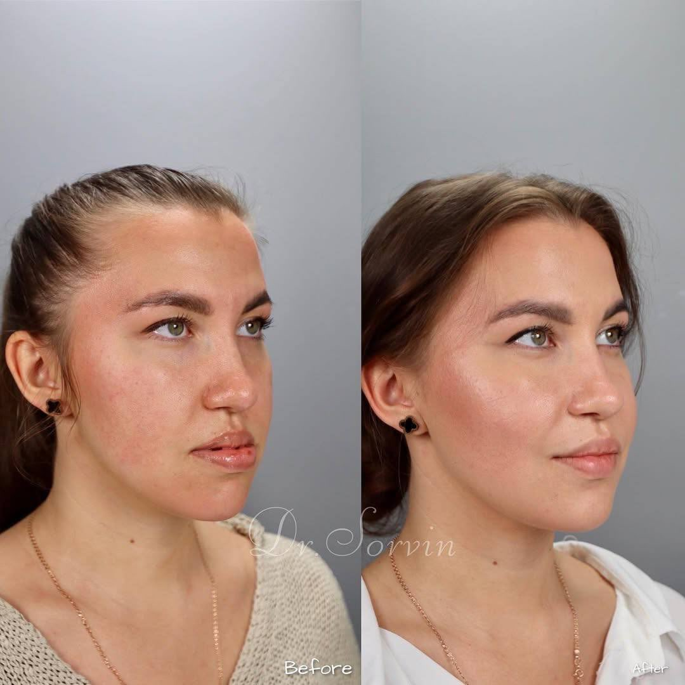
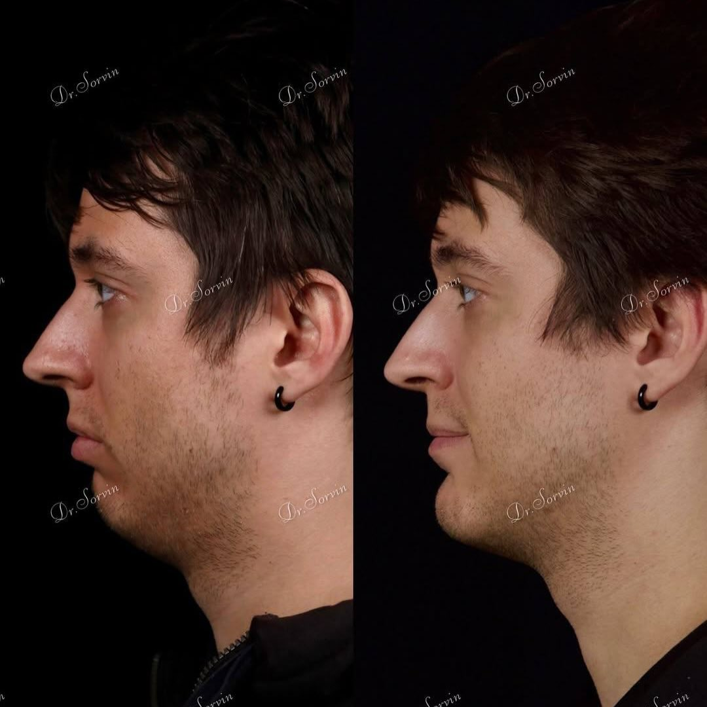
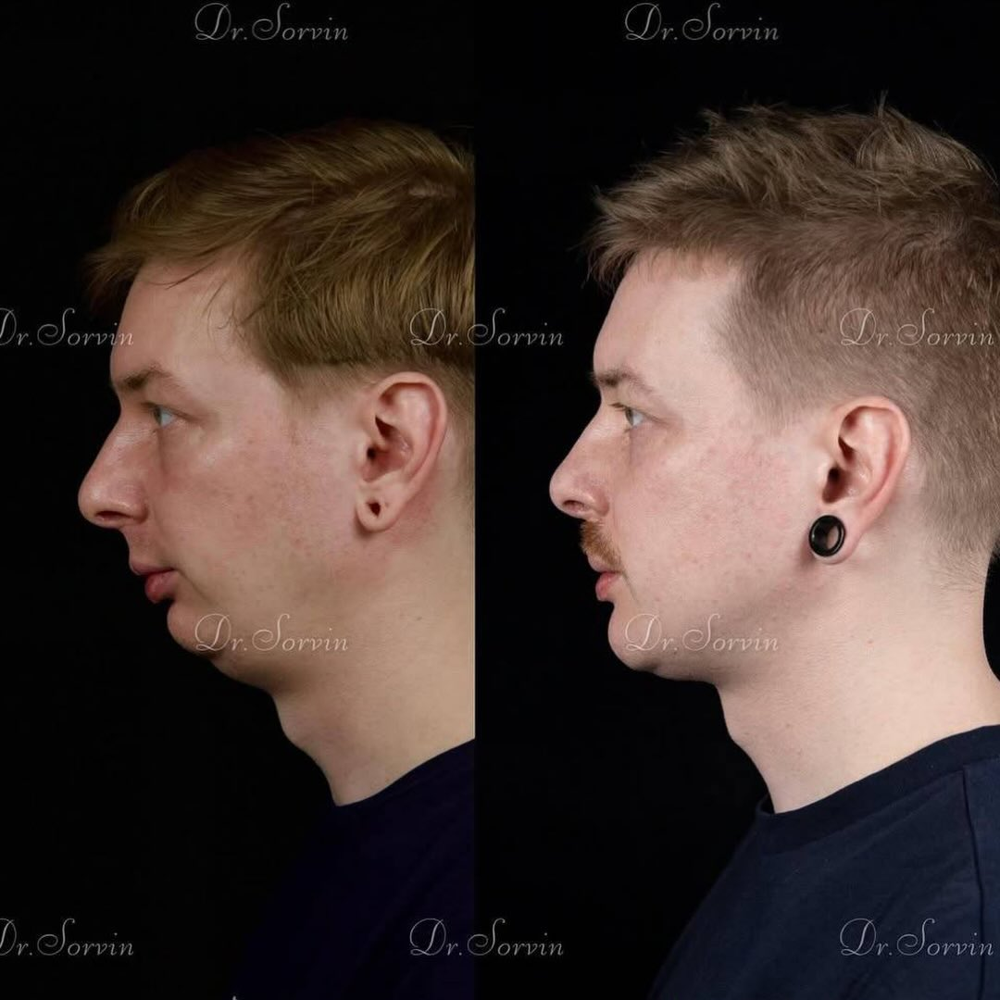
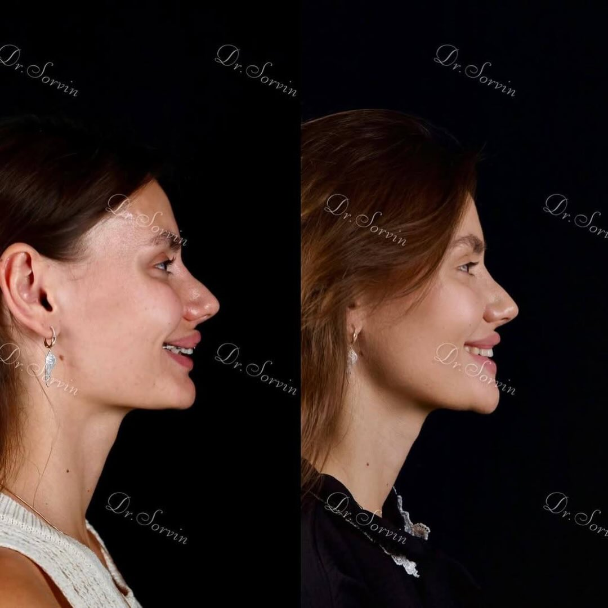

# Сорвин Владимир Андреевич

## 1. Кратко о враче

**Сорвин Владимир Андреевич**  
Челюстно-лицевой хирург. Ортогнатическая хирургия.

Кандидат медицинских наук, выпускник МГМСУ им. А.И. Евдокимова. Специализируется на ортогнатической хирургии: хирургической коррекции прикуса, положения верхней и нижней челюсти, подбородка и пропорций лица при нарушениях зубочелюстной системы. Профессиональный профиль дополняют курсы по ортогнатической хирургии, ВНЧС, ринопластике, блефаропластике и хирургии лица.

## 2. Ключевые факты

- Челюстно-лицевой хирург.
- Кандидат медицинских наук.
- Образование и подготовка: МГМСУ им. А.И. Евдокимова.
- Профиль: ортогнатическая хирургия, гениопластика, коррекция положения верхней и нижней челюсти.
- 61 отзыв на ПроДокторов, в том числе подробные отзывы после ортогнатических операций.

## 3. Подход врача

**Прикус, функция и пропорции лица в одном плане**

В ортогнатической хирургии форма лица не рассматривается отдельно от функции. Положение челюстей влияет на прикус, работу зубочелюстной системы, профиль, подбородок, асимметрию и общую гармонию лица.

Сорвин В.А. работает с такими задачами через планирование: оценивает снимки, исходную анатомию, ортодонтическую подготовку и ожидаемые изменения. Важно не просто «переместить челюсть», а понять, как хирургическое решение повлияет на прикус, профиль и стабильность результата.

## 4. С чем обращаются к Сорвину В.А.

С чем можно обратиться:

- ортогнатическая хирургия;
- коррекция прикуса хирургическим методом;
- перемещение верхней и / или нижней челюсти;
- гениопластика;
- ремоделирование лицевого скелета;
- асимметрия нижней трети лица;
- реконструкция после травм;
- функциональные жалобы, связанные с положением челюстей, — после очной диагностики и подтверждения показаний.

## 5. Как проходит маршрут пациента

Ортогнатическая хирургия редко начинается с решения «просто сделать операцию». Обычно пациенту нужен маршрут:

1. Консультация Сорвина В.А.
2. Анализ снимков, прикуса, положения челюстей и жалоб.
3. При необходимости — работа с ортодонтом.
4. Обсуждение хирургического плана и моделирования.
5. Подготовка к операции.
6. Операция.
7. Послеоперационное наблюдение и контроль этапов восстановления.

Такой маршрут помогает заранее понять, почему ортогнатическая хирургия требует подготовки, совместной работы с ортодонтом и индивидуального плана лечения.

## 6. Онлайн-консультация и моделирование

Онлайн-консультация Сорвина В.А. может включать разбор снимков, предварительный маршрут лечения и рекомендации по дальнейшей диагностике.

Такая консультация помогает пациенту из Казани или другого города понять, есть ли показания к ортогнатическому маршруту, какие документы и снимки нужны, какие этапы лечения возможны и когда требуется очная консультация.

## 7. Результаты до/после

**Ортогнатическая хирургия / коррекция профиля**

**Ортогнатическая хирургия: профильный ракурс**

**Ортогнатическая хирургия: профильный ракурс**

**Ортогнатическая хирургия: ракурс 3/4**

## 8. Образование и профессиональный путь

- 2007–2012 — МГМСУ им. А.И. Евдокимова, Москва, стоматология.
- 2012–2013 — интернатура по стоматологии общей практики, МГМСУ им. А.И. Евдокимова.
- 2013–2015 — ординатура по челюстно-лицевой хирургии, МГМСУ им. А.И. Евдокимова.
- 2015–2018 — аспирантура, МГМСУ им. А.И. Евдокимова.
- 2021 — присуждена ученая степень кандидата медицинских наук.

Дополнительно подтверждаются курсы и конгрессы по ортогнатической хирургии, ринопластике, блефаропластике, ВНЧС и хирургии лица.

## 9. Отзывы

**[Ортогнатическая операция] Врач заранее изучает снимки и планирует маршрут**

> «Первичный осмотр. Владимир Андреевич полностью собирает анамнез, заранее даёт информацию, какие снимки и обследования необходимо иметь с собой на приёме. На первичной консультации уже знаком с вашими снимками и даёт информацию об операции, опираясь конкретно на ваш случай».

ПроДокторов, 19.01.2026 · [Оригинал отзыва](https://prodoctorov.ru/moskva/vrach/394580-sorvin/otzivi/)

**[Ортогнатическая хирургия] Сложный случай после нескольких этапов лечения**

> «У меня была аномалия развития обеих челюстей. По рекомендации ортодонта обратилась к Сорвину Владимиру Андреевичу. Случай усложнялся моим третьим по счету ортодонтическим лечением. Операция проходила в марте 2025 года».

ПроДокторов, 09.11.2025 · [Оригинал отзыва](https://prodoctorov.ru/moskva/vrach/394580-sorvin/otzivi/)

**[Этапное лечение] Пациент готов к продолжению маршрута**

> «Оперировалась у челюстно-лицевого хирурга Владимира Андреевича Сорвина 5 января 2024 года. Мне предстоит вторая операция через год, и теперь я ни капли не переживаю, потому что знаю, какие профессионалы тут работают».

ИПХиК, операция 05.01.2024 · [Оригинал отзыва](https://iphk.ru/specialists/stomatologiya/sorvin-vladimir-andreevich-/)

## 10. Вопросы и ответы

**Ортогнатическая хирургия — это пластическая операция?**  
Ортогнатическая хирургия находится на стыке функции и эстетики. Она направлена на коррекцию положения челюстей и прикуса, а изменения пропорций лица являются частью общего хирургического плана.

**Можно ли прийти к Сорвину В.А., если меня беспокоит подбородок или профиль?**  
Да. На консультации врач оценивает, связана ли задача только с подбородком или с положением челюстей и прикусом. От этого зависит маршрут: гениопластика, ортогнатическая операция, ортодонтическая подготовка или другой план.

**Нужен ли ортодонт перед ортогнатической операцией?**  
Во многих случаях да. Ортогнатический маршрут часто требует совместной работы хирурга и ортодонта. Точный порядок определяется после диагностики.

**Что дает онлайн-консультация?**  
Онлайн-консультация помогает предварительно разобрать ситуацию, понять, какие снимки и документы нужны, и обсудить возможный маршрут лечения. Точный объем консультации администратор уточнит при записи.

**Можно ли гарантировать результат ортогнатической операции?**  
Нет. Результат зависит от анатомии, диагноза, подготовки, объема операции, восстановления и соблюдения рекомендаций. На консультации врач объясняет реалистичный прогноз и ограничения.

## Запись на консультацию

**Записаться на консультацию к Сорвину В.А.**

На консультации Сорвин В.А. разберет Ваш запрос, оценит исходные данные, объяснит возможный маршрут лечения и подскажет, какие обследования нужны для планирования.

Имеются противопоказания. Необходима консультация специалиста.

