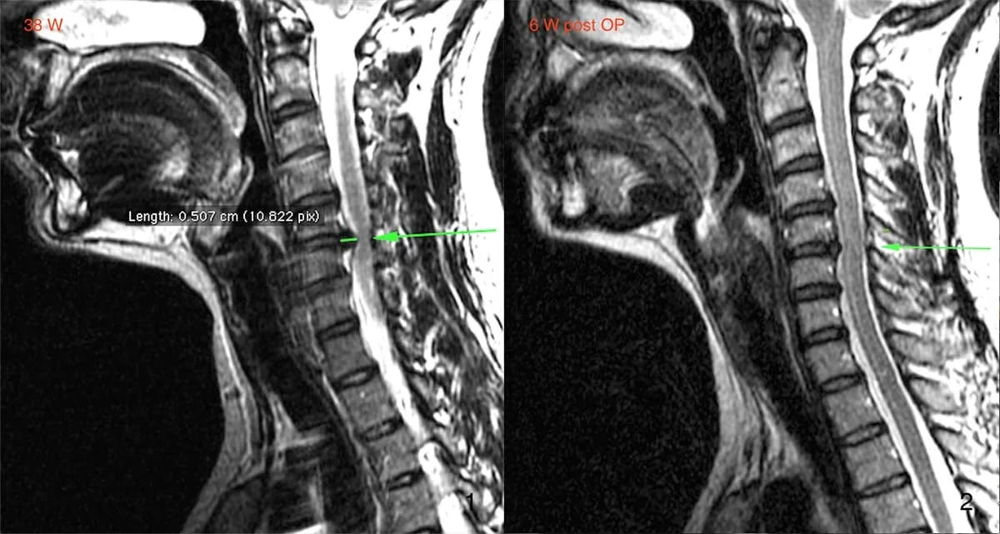
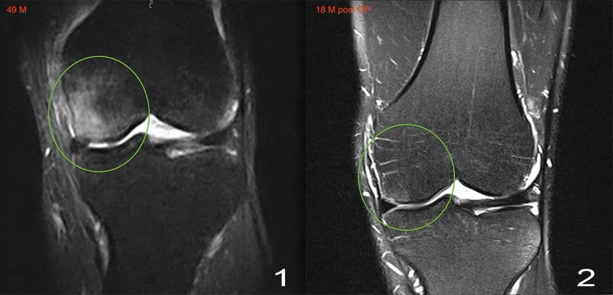
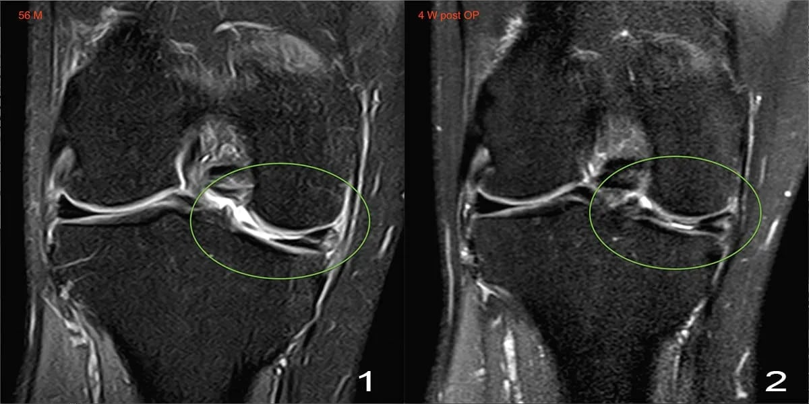
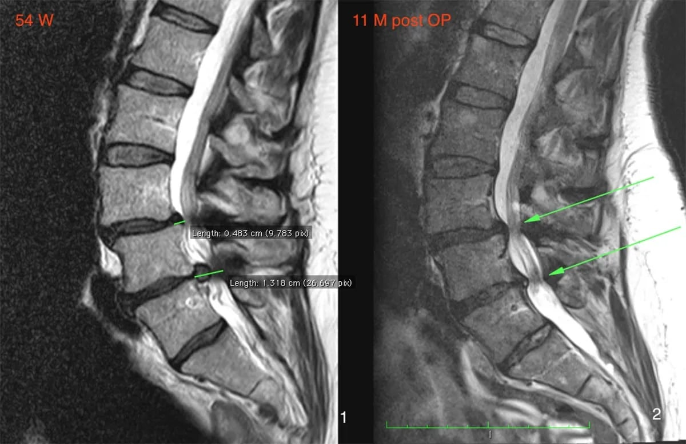
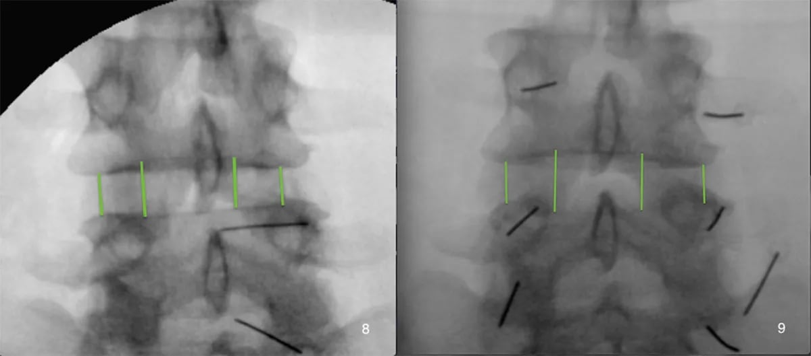

# Бабаян Арсен Викторович

## 1. Кратко о враче

**Бабаян Арсен Викторович**  
Специалист по регенеративной медицине, позвоночнику и суставам. Доктор медицинских наук, профессор.

В The Platinental Казань направление Бабаяна А.В. относится к смежной экспертной медицине для пациентов, которым важны движение, активность, восстановление после боли и бережный разбор альтернатив перед большой операцией.

Ключевое направление врача — микроинвазивная регенеративная реконструкция по системе MIBRAR®. Метод относится к регенеративной медицине: врач изучает снимки, диагноз, историю лечения и оценивает, можно ли работать с поврежденной зоной через собственные биоматериалы пациента.

В The Platinental Казань пациент может записаться на первичный разбор снимков и медицинских документов: онлайн или очно в Казани. Если метод подходит, команда помогает организовать дальнейший маршрут лечения в клинике Мибрар в Ереване. Отдельное направление — профессиональное обучение и мастер-классы по методике Бабаяна А.В.

## 2. Ключевые факты

- Специалист по регенеративной медицине, позвоночнику и суставам; д.м.н., профессор.
- По образованию: врач-нейрохирург, врач-невролог и врач-ортопед.
- Разработчик метода MIBRAR® для микроинвазивной регенеративной реконструкции.
- Акцент для пациента The Platinental Казань: разбор МРТ/КТ, оценка применимости регенеративного подхода, маршрут лечения и сопровождение документов.
- По данным WGZM, специализация включает позвоночник, суставы, нервы, сухожилия, мышцы и связки.
- С 2014 года — основатель и главный врач WGZM, Мюнхен; с 2020 года — основатель и главный врач MIBRAR GmbH.
- Рекомендован FOCUS-Gesundheit 2026 на основе независимого исследования.
- Интервью Tatar-inform: «Лечат клетки тела, а не протез».
- Онлайн-консультации, очные консультации в Казани, организация лечения в Мибрар / Ереван.

## 3. Маршрут пациента

**Сначала разбор документов, потом решение о маршруте**

1. Пациент оставляет заявку и передает медицинские документы: МРТ, КТ, выписки, заключения.
2. Команда уточняет запрос и проверяет, достаточно ли данных для первичного разбора.
3. Проводится онлайн-консультация или очная консультация в Казани.
4. Если метод подходит, пациент получает маршрут лечения.
5. При необходимости The Platinental Казань помогает организовать лечение в клинике Мибрар в Ереване.

Маршрут не заменяет медицинское решение. Применимость метода определяет врач после изучения документов, снимков и состояния пациента.

Для пациента это не просто список диагнозов, а понятный экспертный разбор: что происходит с позвоночником или суставом, есть ли альтернатива большой операции, какие документы нужны и где может проходить следующий этап лечения.

## 4. Подход врача

**Регенеративная медицина вместо быстрого выбора операции**

В интервью Tatar-inform Бабаян А.В. объясняет свою логику через регенеративную медицину: при дегенеративных изменениях суставов, дисков, связок или сухожилий врач оценивает, можно ли создать условия для восстановления структуры за счет собственных биоматериалов пациента.

MIBRAR® расшифровывается как микроинвазивная биологическая регенеративная аутологичная реконструкция. В основе метода — микроинвазивный доступ, работа с зоной повреждения и использование собственных биоматериалов пациента.

Для пациента это другой принцип принятия решения: сначала врач изучает снимки, диагноз, историю лечения и общее состояние, затем определяет, возможно ли регенеративное лечение в конкретном случае.

Такой подход хорошо ложится в медицинскую логику The Platinental: сначала диагностика и показания, затем индивидуальный маршрут, без обещаний универсального результата.

## 5. С чем обращаются

К Бабаяну А.В. обращаются за первичным разбором документов и консультацией, когда боль, ограничения движения или изменения на МРТ/КТ требуют экспертного решения. Применимость метода MIBRAR® врач определяет только после изучения снимков, диагноза и истории лечения.

Главный запрос пациента здесь — сохранить движение, разобраться в причине боли, оценить альтернативы большой операции и получить маршрут лечения.

**Когда нужен разбор**

- есть МРТ/КТ и нужно понять, что делать дальше;
- есть боль или ограничение движения, а стандартное лечение не дает ожидаемого эффекта;
- пациенту предлагают большую операцию, и он хочет получить второе мнение;
- нужно оценить, подходит ли регенеративный маршрут;
- требуется организовать консультацию и дальнейшее лечение в профильном центре.

**Примеры медицинских случаев для первичного разбора**

- изменения позвоночника: грыжи, протрузии, стеноз, дегенеративные изменения дисков;
- изменения суставов: артроз, повреждения менисков, патологии плечевого сустава;
- повреждения связок, сухожилий и спортивные травмы;
- боль и ограничения после предыдущих вмешательств.

**Маршрут лечения**

- Онлайн-консультация по снимкам и документам.
- Очная консультация в Казани.
- Организация лечения в Мибрар, Ереван.
- Сопровождение пациента перед поездкой.

**Для врачей**

- Обучение подходу MIBRAR®.
- Мастер-классы по методике Бабаяна А.В.
- Разбор клинических случаев.

## 6. FOCUS-Gesundheit 2026

В 2026 году Prof. Dr. Dr. Arsen Babayan указан в документе FOCUS-Gesundheit как Neurochirurg, München и рекомендован редакцией FOCUS-Gesundheit на основе независимого исследования.

В документе FOCUS-Gesundheit 2026 Бабаян А.В. указан как рекомендованный специалист на основе независимого исследования.

## 7. Образование и профессиональный путь

- 1987-1994 — Ереванский государственный медицинский университет, врач-нейрохирург.
- 1994-1995 — специализация по неврологии, Ташкентский медицинский государственный университет.
- 1995-1996 — специализация по ортопедии и травматологии, Ереванский государственный медицинский университет.
- 1997 — кандидат медицинских наук, International Academy of Education.
- 1998 — доктор медицинских наук, International Academy of Education.
- 2011 — Doctor Honoris Causa, International Academy of Education.
- 2011 — профессор, International Academy of Education.
- С 2014 — основатель и главный врач WGZM, Мюнхен.
- С 2020 — основатель и главный врач MIBRAR GmbH.

## 8. Клинические результаты до/после

**Клинический результат: шейный отдел позвоночника, стеноз C4-C6 и грыжа C5/C6**

**Клинический результат: коленный сустав, гонартроз IV степени**

**Клинический результат: коленный сустав, повреждение медиального мениска**

**Клинический результат: поясничный отдел позвоночника, сколиоз и грыжа L5/S1**

**Клинический результат: поясничный отдел позвоночника, реконструкция дисков L4/L5 и L5/S1**

## 9. Пациентские истории

**Грыжа поясничного диска**

> «Врачи предлагали только операцию — удаление диска и стабилизацию. После процедуры MIBRAR® грыжа значительно уменьшилась уже через 4 месяца. Боль в ноге прошла полностью. Рад, что не согласился на открытую операцию».

Андрей К., 51 год.  
PAS MIBRAR · [Оригинал истории](https://pas-mibrar.com/reviews/)

**Коксартроз обоих суставов**

> «Мне предложили двустороннее эндопротезирование. Бабаян А.В. обработал оба тазобедренных сустава за одну процедуру. Через 3 месяца боль уменьшилась на 85%. Хожу без трости, вернулась к обычной жизни».

Елена М., 64 года.  
PAS MIBRAR · [Оригинал истории](https://pas-mibrar.com/reviews/)

**Грыжа L5/S1**

> «2017 диагностировали большой пролапс межпозвоночного диска в сегменте L5/S1. Я искала альтернативы, потому что очень боялась операции. Бабаян А.В. очень хорошо объяснил мне, как работает его метод, так что я быстро смогла всё понять как пациент».

Anke Menzel.  
MIBRAR.de, интервью 08.05.2020 · [Оригинал интервью](https://mibrar.de/prof-arsen-babayan/)

## 10. Обучение и мастер-классы

Бабаян А.В. проводит профессиональное обучение и разбор клинических случаев по подходу MIBRAR®.

- мастер-классы по методике Бабаяна А.В.;
- обучение врачей принципам MIBRAR®;
- разбор клинических случаев;
- консультации по внедрению подхода в практику.

## 11. Вопросы и ответы

**Можно ли получить консультацию Бабаяна А.В. онлайн?**  
Да. Для первичного разбора могут потребоваться МРТ, КТ, выписки и заключения. Администратор подскажет, как передать документы перед консультацией.

**Можно ли попасть на очную консультацию в Казани?**  
Да. Очную консультацию в Казани можно оформить через администратора; при записи уточнят ближайшие даты приема.

**Где проходит лечение по методике MIBRAR®?**  
Лечение по методике MIBRAR® проводится в специализированных центрах MIBRAR, включая клинику Мибрар в Ереване. Точный маршрут, документы и этапы пациент получает после консультации.

**Метод MIBRAR® подходит всем пациентам?**  
Решение принимает врач после изучения снимков, диагноза, истории лечения и общего состояния пациента.

**Можно ли передать снимки заранее?**  
Да. Для предварительного разбора обычно нужны МРТ/КТ, выписки и заключения. Перед передачей медицинских документов потребуется согласие на обработку медицинских данных.

## Запись на консультацию

**Записаться на консультацию к Бабаяну А.В.**

На консультации врач разберет Ваш запрос, изучит медицинские документы, оценит применимость метода и объяснит возможный маршрут лечения.

Имеются противопоказания. Необходима консультация специалиста.
