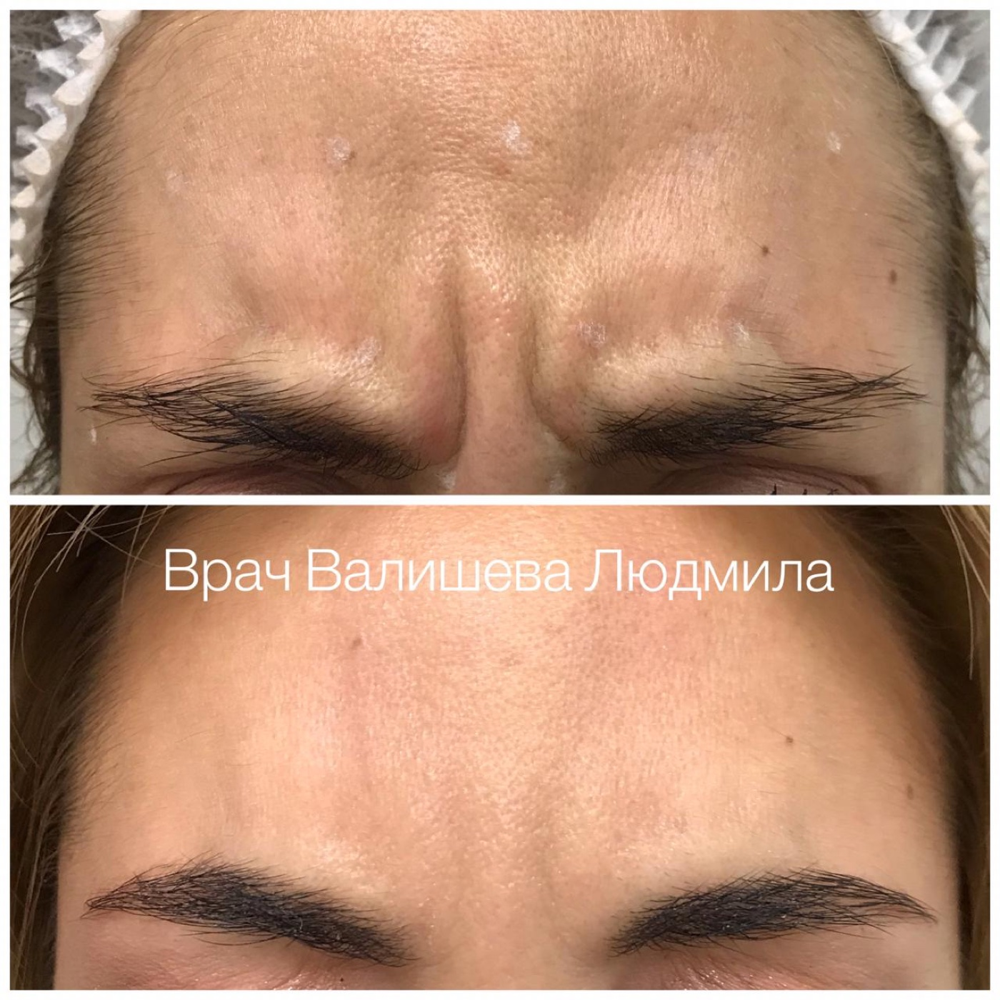
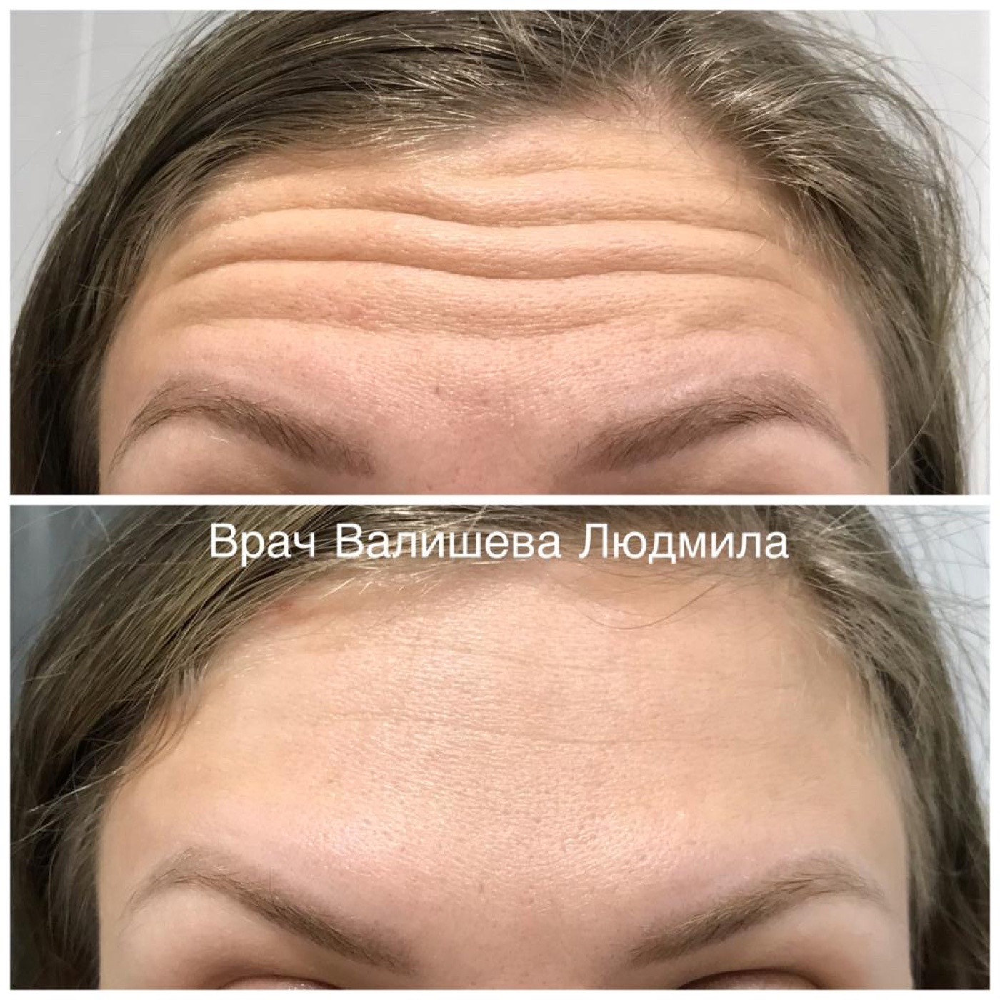

# Валишева Людмила Викторовна

## 1. Кратко о враче

**Валишева Людмила Викторовна**

Врач-косметолог.

Специализируется на anti-age косметологии, инъекционных процедурах, CO2-лазерных методиках, лечении акне и постакне, розацеа, сосудистых изменений, пигментации и рубцов. В работе сочетает дерматовенерологическую базу, оценку качества кожи и спокойный план коррекции без чрезмерного усиления черт лица.

На консультации Валишева Л.В. оценивает состояние кожи, мимику, тон, прошлые процедуры, домашний уход и ограничения. После этого врач объясняет, какие методы уместны сейчас: CO2-лазерные процедуры, инъекции, восстановительный уход или этапный курс.

## 2. Ключевые факты

- Врач-косметолог.
- Общий стаж в косметологии и дерматовенерологии — с 2014 года.
- Профиль: anti-age, качество кожи, мимические морщины, акне, постакне, розацеа, сосудистые изменения, пигментация и рубцы.
- Аппаратные методики: CO2-лазер Deka.
- Инъекционные процедуры: контурная пластика, векторный лифтинг, ботулинотерапия, full face, лечение гипергидроза, биоревитализация, коллагеностимуляция, коллагенотерапия и плазмотерапия.
- Опыт работы — более 10 лет.

## 3. Подход врача

**Хорошая косметология — та, которую не видно**

Подход Валишевой Л.В. строится вокруг естественного результата: кожа выглядит ухоженнее, тон спокойнее, мимика остается живой. Врач оценивает весь контекст: состояние тканей, выраженность воспаления, сосудистую реактивность, пигментацию, рубцовые изменения, привычный уход и ожидания пациента.

Такой подход помогает выбрать достаточный объем коррекции. Иногда основная задача — успокоить воспаление и восстановить барьер кожи. В других случаях важнее работа с мимикой, плотностью кожи, тоном, рубцами или постакне. План может включать CO2-лазерные методики, инъекционные процедуры, домашний уход и наблюдение в динамике.

## 4. Направления работы

### Дерматологические задачи

- акне и постакне;
- розацеа;
- сосудистые изменения;
- пигментация;
- чувствительность и реактивность кожи.

### Аппаратные методики

- лазерное омоложение CO2 на аппарате Deka;

### Инъекционные процедуры

- контурная пластика;
- векторный лифтинг;
- ботулинотерапия;
- full face коррекция;
- лечение гипергидроза;
- биоревитализация;
- коллагеностимуляция и коллагенотерапия;
- плазмотерапия.

### Восстановление и работа с рубцами

- рубцовые изменения;
- следы постакне;
- восстановление качества кожи после воспалений;
- поддержка плотности и тонуса тканей.

## 5. Образование и квалификация

- 2013 — Казанский государственный медицинский университет, педиатрия.
- 2014 — Казанский государственный медицинский университет, дерматовенерология.
- 2015 — Казанский государственный медицинский университет, косметология.
- 2019 — РУДН, косметология.
- 2025 — НАПС, косметология.

## 6. Опыт

Опыт работы — более 10 лет.

## 7. Сфера интересов

Валишева Л.В. работает с пациентами, которым важен естественный вид результата: более ровный тон, спокойная мимика, лучшее качество кожи и понятный план ухода. Врач помогает выстроить последовательность процедур при акне, постакне, розацеа, пигментации, сосудистых изменениях и рубцах.

Отдельная зона интереса — anti-age без резкого изменения лица: работа с верхней третью, мимическими морщинами, плотностью кожи и восстановлением тканей.

## 8. Фото до/после

Фотографии показывают отдельный клинический случай; план и динамика зависят от состояния кожи, процедур и восстановления.

## 9. Вопросы и ответы

**С чем можно обратиться к Валишевой Л.В.?**

С акне, постакне, розацеа, сосудистыми изменениями, пигментацией, рубцами, возрастными изменениями кожи, мимическими морщинами и запросом на естественный anti-age план.

**Можно ли прийти без понимания конкретной процедуры?**

Да. Консультация нужна, чтобы оценить кожу, запрос, прошлые процедуры и ограничения. После осмотра врач объяснит, какие методы подходят сейчас.

**Валишева Л.В. работает с аппаратными методиками?**

Да. В профиле врача указан CO2-лазер Deka.

**Можно ли работать с рубцами и постакне?**

Да. В профиль врача входят постакне, рубцовые изменения, лазерные и восстановительные методики. Конкретный план зависит от типа рубца, состояния тканей и предыдущего лечения.

**Чем отличается anti-age план у косметолога?**

Врач оценивает качество кожи, мимику, тон, сосудистые изменения, пигментацию и домашний уход. После этого подбирается последовательность процедур, которая соответствует состоянию тканей и задаче пациента.

## Запись на консультацию

**Записаться на консультацию к Валишевой Л.В.**

На консультации врач разберет Ваш запрос, оценит состояние кожи, мимику, тон и ограничения, затем объяснит, какие косметологические процедуры или уход уместны именно в Вашем случае.

Имеются противопоказания. Необходима консультация специалиста.
